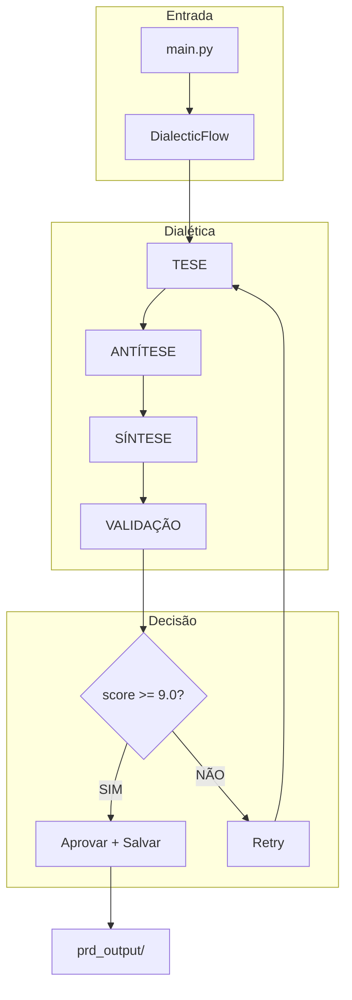

# 🔷 Dialectic Crew AI

> Sistema de geração automática de PRD usando dialética socrática/hegeliana com CrewAI.

[](https://www.python.org/)
[](https://crewai.com)
[](LICENSE)

## O que é?

O **Dialectic Crew AI** é um sistema que gera PRDs (Product Requirement Documents) de alta qualidade usando um processo dialético:

```
TESE → ANTÍTESE → SÍNTESE → VALIDAÇÃO → (RETRY ATÉ 9.0)
```

- **Tese (Visionário)**: Propõe solução inicial
- **Antítese (Crítico)**: Destrói a proposta com críticas
- **Síntese (Sintetizador)**: Fundem as ideias na melhor versão
- **Validação (Gate)**: Aprova se score >= 9.0

## ✨ Features

- 🤖 4 agentes IA trabalhando em harmonia
- 🔄 Retry automático até atingir nota 9.0
- 📋 Validação Pydantic do PRD
- 🛡️ Anti-drift: todos os agentes leem VISION.md
- 💾 Auto-save do PRD aprovado

## 📁 Estrutura

```
dialectic-crew-ai/
├── main.py              # Entry point
├── flow.py              # Fluxo dialético com estado
├── agents.py            # 4 agentes CrewAI
├── schemas.py           # PRDSchema Pydantic
├── tools.py             # Ferramentas
├── VISION.md            # Visão macro (EDITE!)
├── docs/                # Documentação
│   └── README.md        # Diagramas Mermaid
├── prd_output/          # PRDs gerados
├── requirements.txt
├── .env.example
└── README.md            # Este arquivo
```

## 🚀 Instalação

```bash
# Clone/crie a pasta
cd dialectic-crew-ai

# Crie ambiente virtual (Python 3.10-3.13)
python -m venv venv
source venv/bin/activate  # Linux/Mac
# venv\Scripts\activate   # Windows

# Instale dependências
pip install -r requirements.txt

# Configure API key
cp .env.example .env
# Edite .env e adicione sua API key
```

## 🔑 Configuração de API Key

O sistema suporta múltiplos provedores:

```bash
# OpenAI (padrão)
OPENAI_API_KEY=sk-...

# Anthropic (Claude)
ANTHROPIC_API_KEY=sk-ant-...

# Groq (rápido!)
GROQ_API_KEY=...

# MiniMax
MINIMAX_API_KEY=...
```

No `agents.py`, configure o LLM:

```python
LLM = "gpt-4o"                    # OpenAI
# ou
LLM = "claude-3-5-sonnet-20241022" # Anthropic
# ou
LLM = "groq/llama-3.3-70b"         # Groq
```

## 📝 Como Usar

### 1. Edite VISION.md

Este é o arquivo mais importante! Contiene a visão macro do SEU sistema.

```markdown
# Visão Macro do Sistema

## Sobre o Projeto
Seu projetoawesome

## Objetivos
1. Objetivo 1
2. Objetivo 2

## Stack
- Backend: Python/FastAPI
- Frontend: React

## Requisitos Não-Funcionais
- Performance: <200ms
- Uptime: 99.9%
```

### 2. Execute

```bash
python main.py "Sistema de pagamentos com Pix"
```

### 3. Resultado

O PRD será salvo automaticamente em `prd_output/PRD_YYYYMMDD_HHMM.json`!

## 🔄 Fluxo de Trabalho



## 📊 Exemplo de PRD Gerado

```json
{
  "feature_name": "Sistema de pagamentos com Pix",
  "version": "1.0",
  "objective": "Implementar processamento de Pix...",
  "macro_impact": {
    "modules_affected": ["payments", "users", "notifications"],
    "risk_level": "HIGH",
    "performance_impact": "Alta carga transacional",
    "security_impact": "PCI-DSS compliance"
  },
  "user_stories": [
    {
      "id": "US-001",
      "title": "Receber Pix",
      "description": "Como usuário, quero receber Pix...",
      "acceptance_criteria": ["Critério 1", "Critério 2"],
      "effort": "M",
      "dependencies": []
    }
  ],
  "anti_drift_questions": [
    {"question": "Align with VISION?", "answer": "Yes"}
  ],
  "quality_score": 9.5,
  "consensus_reached": true,
  "final_validation_notes": "Aprovado!"
}
```

## 🛠️ Customização

### Adicionar Agente

Edite `agents.py`:

```python
novo_agente = Agent(
    role="Seu Papel",
    goal="Seu objetivo",
    backstory="Seu contexto...",
    tools=[file_read_tool],
    llm=LLM
)
```

### Mudar Schema

Edite `schemas.py`:

```python
class PRDSchema(BaseModel):
    # Adicione seus campos
    seu_campo: str
```

## 📚 Requisitos

- Python 3.10 - 3.13
- API Key (OpenAI/Anthropic/Groq/MiniMax)

## ⚠️ Notas

1. **VISION.md é obrigatório** - Sem ele, não há contexto
2. **API key necessária** - Sem LLM, não funciona
3. **Custo** - Cada iteração faz múltiplas chamadas ao LLM
4. **Tempo** - Pode levar vários minutos

## 🤝 Contribuição

Sinta-se livre para fork,改进, e enviar PRs!

---

Feito com ☕ e dialética por [Camilo]()

## 📖 Documentação

Veja [`docs/README.md`](docs/README.md) para diagramas detalhados!
