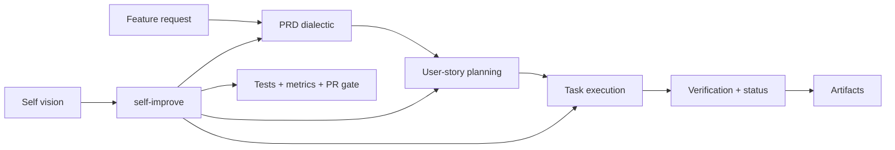

# Dialectic Crew AI — Documentation

Dialectic Crew AI is a **CrewAI-based dialectic delivery engine**. It generates PRDs, plans user stories, executes implementation tasks, verifies outcomes, and can improve itself against its internal roadmap.

Two vision documents anchor the system:

- [`../knowledge/VISION.md`](../knowledge/VISION.md) — the active project vision for normal runs
- [`../internal/SELF_VISION.md`](../internal/SELF_VISION.md) — the app's own roadmap for `--self` and `self-improve`

## Documentation index

| Document | Description |
|---|---|
| [Getting Started](getting-started.md) | Installation, prerequisites, first workflow, and self-improve basics |
| [Architecture](architecture.md) | Module layout, data flow, self-improve orchestration, and MCP/skills integration |
| [Flows](flows.md) | PRD, planning, task execution, orchestrator, and self-improve flow behavior |
| [Agents](agents.md) | Agent roles, tools, LLM tiers, and MCP wiring |
| [Data Models](schemas.md) | Pydantic schemas used across PRD, planning, execution, and self-improvement |
| [CLI Reference](cli.md) | Command reference for `prd`, `plan`, `execute`, `status`, `verify-story`, `verify`, `mark`, and `self-improve` |
| [Configuration](configuration.md) | Environment variables for models, exports, metrics, MCP, hooks, and self-improve |
| [Export System](export.md) | JSON/Markdown export behavior, validation, and rollback semantics |

## What the codebase currently does



Key shipped capabilities:

- PRD generation with retry-to-threshold validation
- User-story planning with dialectic refinement
- Task execution using dialectic → verify → reimplement
- Story-level re-verification via `verify-story`
- Passive metrics and hook-based token / cost tracking
- Four-lens introspection and dialectic prioritization
- Built-in local `skills_mcp` server wired into four core agents

## Project structure

```text
dialectic-crew-ai/
├── internal/SELF_VISION.md
├── knowledge/VISION.md
├── docs/
├── src/
│   ├── dialectic/
│   ├── execution/
│   ├── main/
│   ├── mcp/
│   └── planning/
├── tests/
├── exec_output/
└── prd_output/
```

If you're deciding where to dive in:

- start with [`architecture.md`](architecture.md) for system shape
- use [`agents.md`](agents.md) for MCP and model wiring
- use [`cli.md`](cli.md) when driving the tool from the terminal
- use [`flows.md`](flows.md) for execution behavior and routing details