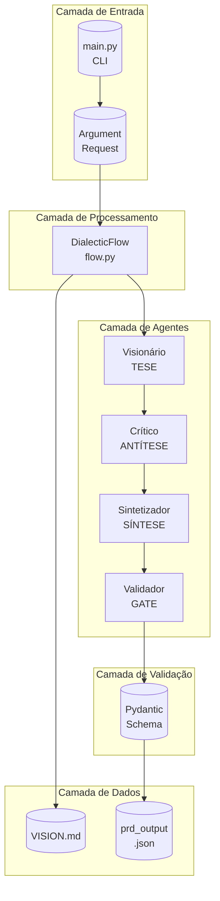
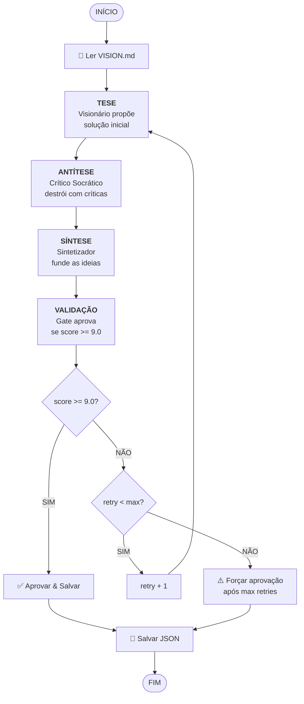
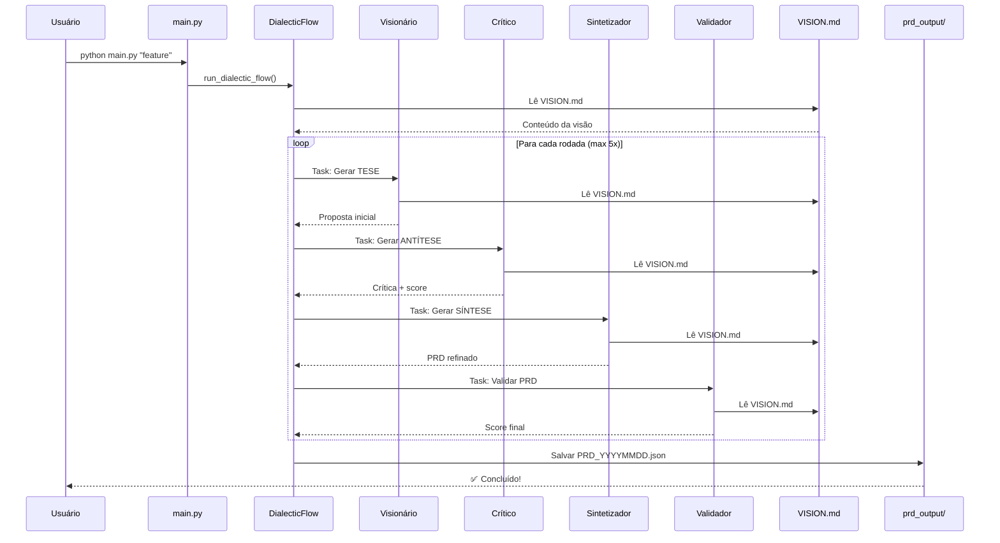
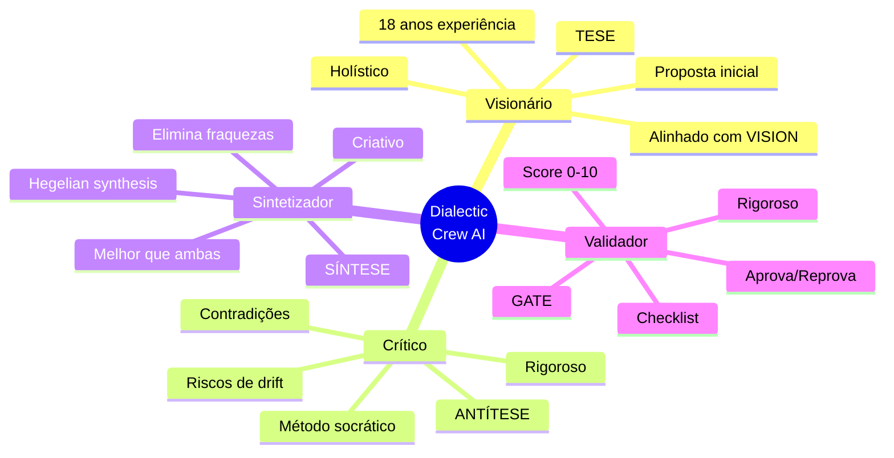
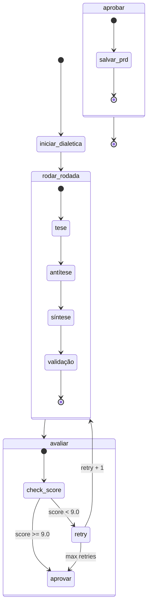
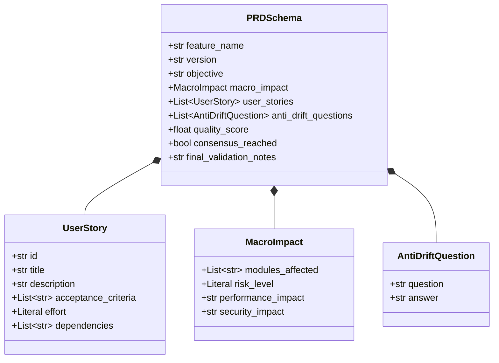
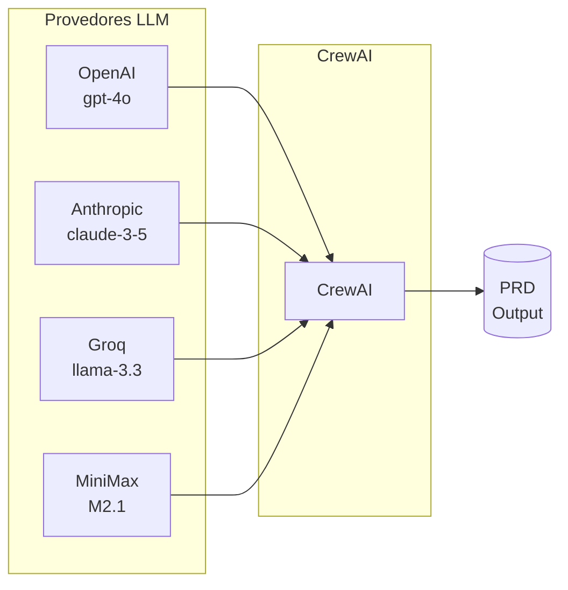
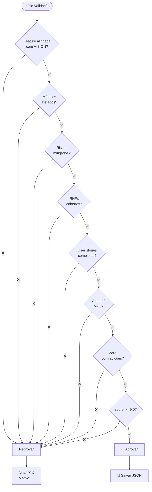
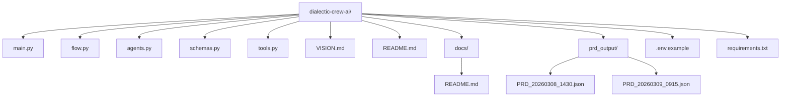
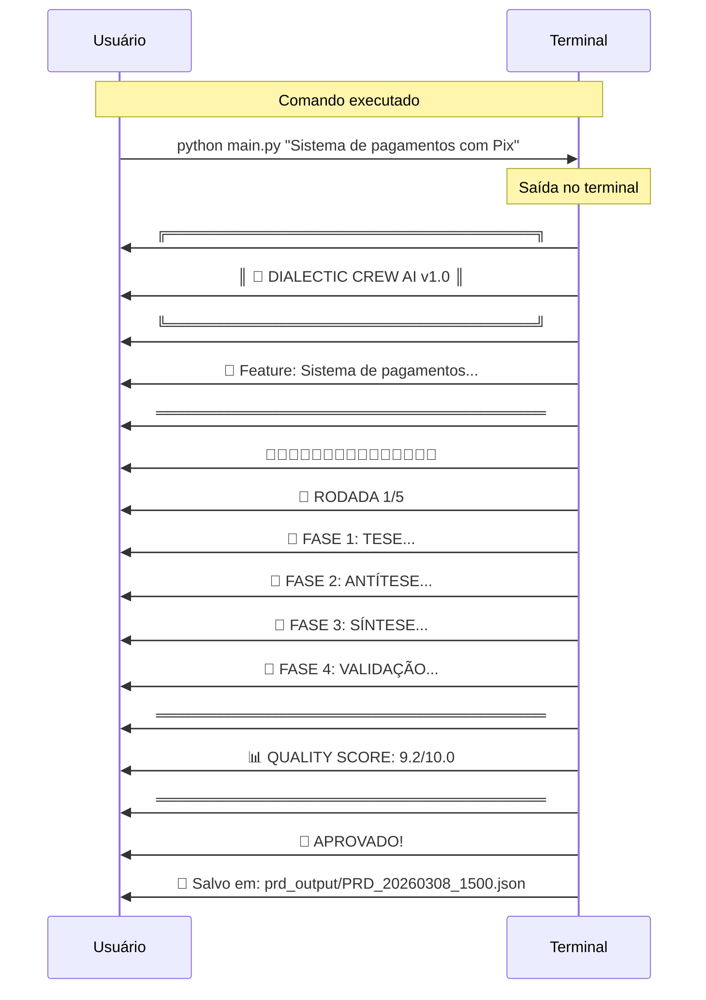

# 📚 Documentação Técnica - Dialectic Crew AI

> Documentação completa com diagramas Mermaid

---

## 1. Arquitetura Geral do Sistema



---

## 2. Fluxo Dialético Completo



---

## 3. Diagrama de Sequência



---

## 4. Agentes e Suas Responsabilidades



---

## 5. Máquina de Estados do Fluxo



---

## 6. Estrutura de Dados - Schema Pydantic



---

## 7. Fluxo de Retry Automático

```mermaid
flowchart LR
    subgraph "Retry Loop"
        R1[Rodada 1<br/>Score: 6.5] --> R2[Rodada 2<br/>Score: 7.8]
        R2 --> R3[Rodada 3<br/>Score: 8.4]
        R3 --> R4[Rodada 4<br/>Score: 9.2]
    end
    
    R1 -.->|"Reprovar<br/>retry + 1"| R2
    R2 -.->|"Reprovar<br/>retry + 1"| R3
    R3 -.->|"Reprovar<br/>retry + 1"| R4
    R4 ==>"✅ Aprovar<br/>score >= 9.0"| AP[Approved]
```

---

## 8. Integrações e APIs Suportadas



---

## 9. Checklist de Validação



---

## 10. Estrutura de Diretórios



---

## 11. Exemplo de Execução



---

## 12. Métricas do Sistema

```mermaid
gauge
    title "Quality Score Target"
    0-5: "Reprovado"
    5-7: "Precisa melhorar"
    7-9: "Quase lá"
    9-10: "✅ Aprovado"
    9.0
```

| Métrica | Valor |
|---------|-------|
| Score Mínimo | 9.0 |
| Max Retries | 5 |
| Mín. User Stories | 3 |
| Mín. Anti-Drift | 5 |
| Módulos por feature | Variável |

---

## 📖 Ver Também

- [VISION.md](../VISION.md) - Visão macro do sistema
- [README.md](../README.md) - Documentação principal
- [agents.py](../agents.py) - Código dos agentes
- [flow.py](../flow.py) - Implementação do fluxo
- [schemas.py](../schemas.py) - Schemas Pydantic
