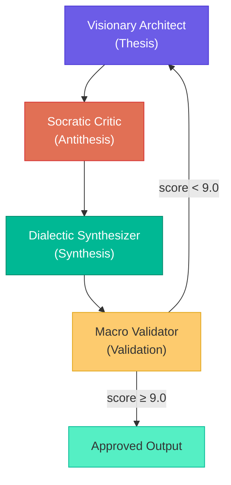

# Dialectic Crew AI — Documentation

Dialectic Crew AI is an automated **PRD (Product Requirement Document) generator** that applies the **Socratic/Hegelian dialectic method** through multi-agent orchestration powered by [CrewAI](https://docs.crewai.com).

Every proposal passes through a rigorous cycle of **Thesis → Antithesis → Synthesis → Validation**, producing high-quality, well-vetted PRDs and execution plans.

---

## Documentation Index

| Document | Description |
|----------|-------------|
| [Getting Started](getting-started.md) | Installation, prerequisites, and first run |
| [Architecture](architecture.md) | System architecture, module layout, and design decisions |
| [Flows](flows.md) | CrewAI Flow pipelines (PRD, Planning, Task Execution) with diagrams |
| [Agents](agents.md) | Agent definitions, roles, LLM tier strategy |
| [Data Models](schemas.md) | Pydantic schemas and data flow |
| [CLI Reference](cli.md) | All commands and usage examples |
| [Configuration](configuration.md) | Environment variables and export settings |
| [Export System](export.md) | Dual export (JSON + Markdown), validation, rollback |

---

## How It Works (High-Level)


Each stage uses the same dialectic pattern with four specialized AI agents:



---

## Project Structure

```
dialectic-crew-ai/
├── main.py                    # Bootstrap entry point
├── VISION.md                  # System macro vision (read by all agents)
├── pyproject.toml             # Build config and dependencies
├── .env                       # API keys and runtime config
├── src/
│   ├── schemas.py             # Pydantic data models (source of truth)
│   ├── dialectic/             # Core dialectic engine
│   │   ├── agents.py          # 5 CrewAI agents with LLM tiers
│   │   ├── prd_flow.py        # PRD generation flow
│   │   ├── state.py           # DialecticState model
│   │   ├── config.py          # Export config loader
│   │   ├── export.py          # PRD/plan export (JSON+MD)
│   │   └── tools.py           # CrewAI tools (FileRead, FileWrite)
│   ├── planning/              # User story planning
│   │   └── flow.py            # Dialectic planning flow
│   ├── execution/             # Plan execution engine
│   │   ├── dialectic_execution.py  # Orchestrator
│   │   ├── task_flow.py       # Per-task CrewAI Flow
│   │   ├── runner.py          # Spec markdown generation
│   │   └── verify.py          # Task tracking and verification
│   └── main/
│       └── cli.py             # CLI commands
├── tests/                     # Test suite
└── docs/                      # This documentation
    └── plots/                 # Auto-generated CrewAI flow visualizations
```

---

## Quick Start

```bash
# Clone and install
git clone <repo-url>
cd dialectic-crew-ai
pip install -e .

# Configure
cp .env.example .env
# Add your OPENAI_API_KEY to .env

# Generate a PRD
python main.py prd "Login with two-factor authentication"

# Plan a user story
python main.py plan

# Execute the plan
python main.py execute
```

See [Getting Started](getting-started.md) for detailed setup instructions.
