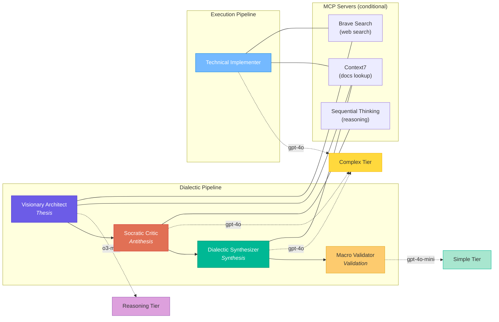
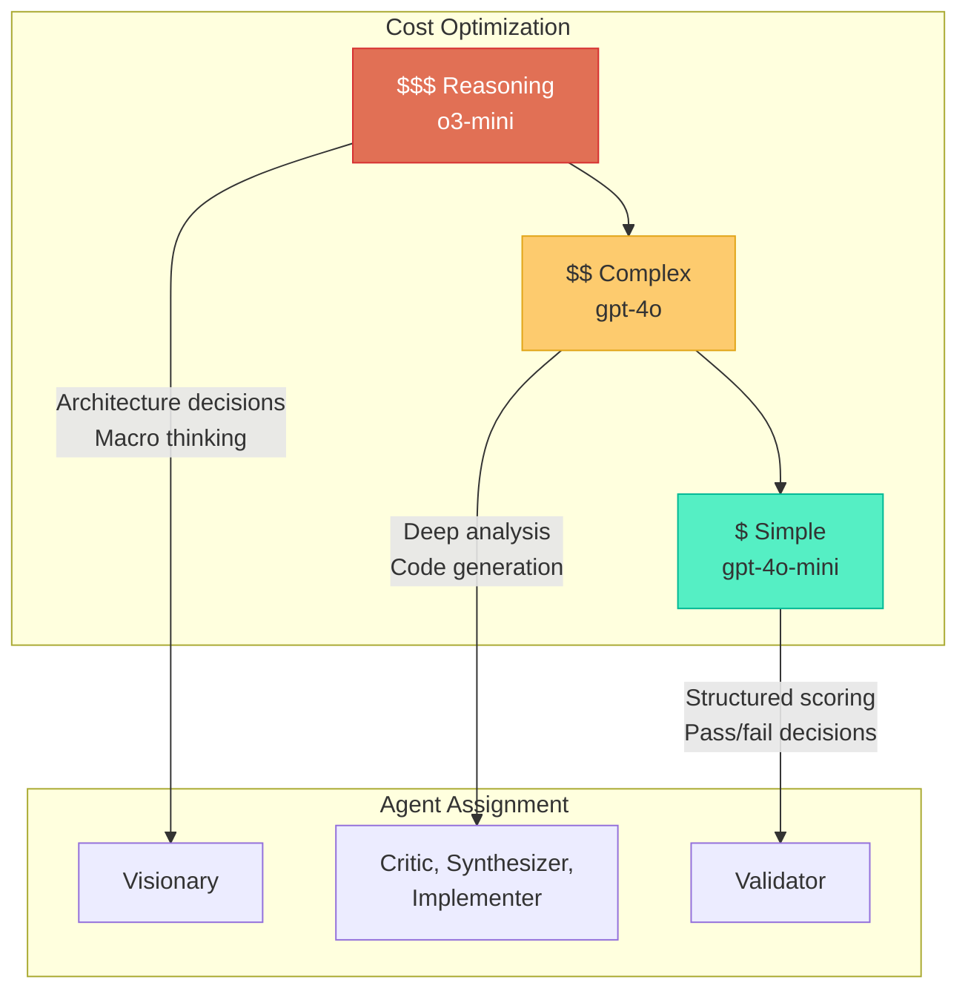

# Agents

Dialectic Crew AI defines five specialized agents, each with a distinct role in the dialectic process. Agents are defined as **factory functions** in `src/dialectic/agents.py` — each call returns a fresh `Agent` instance to prevent cross-flow memory contamination. The module also exports `vision_knowledge(context)`, which creates a `TextFileKnowledgeSource` for the active vision document.

### Vision Knowledge

`vision_knowledge()` accepts an optional `VisionContext` parameter that determines which vision document to load:

| Call | Document | Use Case |
|------|----------|----------|
| `vision_knowledge()` | `knowledge/VISION.md` | Default — user project visions |
| `vision_knowledge(VisionContext.SELF)` | `internal/SELF_VISION.md` | App self-improvement (`--self` flag) |

The `VisionContext` enum is defined in `src/dialectic/vision.py`. All vision-related functions (`get_vision_path`, `ensure_vision_path`, `get_vision_hash`, `vision_knowledge`) accept this parameter, defaulting to `VisionContext.PROJECT`.

Agent backstories reference "VISION.md" generically — they consult whatever vision document the Crew loaded into its `knowledge_sources`. The context switch happens at the Crew level (via `vision_knowledge(context)`), not in individual agent definitions. This keeps agent factories context-agnostic.

---

## Agent Overview



---

## Agent Definitions

### 1. Visionary Architect (`visionario`)

| Property | Value |
|----------|-------|
| **Role** | Senior Visionary Architect |
| **Goal** | Propose the most elegant initial solution aligned with the system's macro vision |
| **LLM Tier** | Reasoning (`o3-mini`) |
| **Reasoning** | `True` (max 3 attempts) |
| **Tools** | CodeDocsSearchTool (optional) |
| **MCP Servers** | Context7, Brave Search |
| **Phase** | Thesis |

The Visionary generates bold, comprehensive initial proposals. With 18 years of simulated architectural experience, it always consults the active vision document (available via the Crew's knowledge sources) and considers the system holistically: affected modules, non-functional requirements, and the ideal speed-quality tradeoff. Its backstory references "VISION.md" generically — the actual document loaded (`knowledge/VISION.md` or `internal/SELF_VISION.md`) depends on the `VisionContext` set at the Crew level. Has access to Context7 for up-to-date library documentation and Brave Search for real-time web research.

### 2. Socratic Critic (`critico_socratico`)

| Property | Value |
|----------|-------|
| **Role** | Relentless Socratic Critic |
| **Goal** | Rigorously evaluate whether the implementation meets what was requested, without expanding scope |
| **LLM Tier** | Complex (`gpt-4o`) |
| **Reasoning** | `True` (max 2 attempts) |
| **Tools** | None |
| **MCP Servers** | Sequential Thinking |
| **Phase** | Antithesis |

The Critic is the devil's advocate. Its fundamental rule is to evaluate **only** what the task requests — never expanding scope. Uses the Sequential Thinking MCP server for structured reasoning. It checks for:
- Point-by-point task fulfillment
- Contradictions with the macro vision (accessed via knowledge sources)
- Overscope (doing more than requested)
- Technical bugs or errors
- Fair scoring within the task's scope

### 3. Dialectic Synthesizer (`sintetizador`)

| Property | Value |
|----------|-------|
| **Role** | Dialectic Synthesizer |
| **Goal** | Transform thesis + antithesis into a superior version, eliminating ALL weaknesses |
| **LLM Tier** | Complex (`gpt-4o`) |
| **Reasoning** | `True` (max 2 attempts) |
| **Tools** | None |
| **MCP Servers** | Context7 |
| **Phase** | Synthesis |

The Synthesizer is "Hegel in code form." It receives both the proposal and the critiques, producing a synthesis that:
- Preserves the thesis's strengths
- Incorporates all critiques from the antithesis
- Eliminates all identified weaknesses
- Resolves contradictions creatively

The synthesis is not a mediocre middle ground — it is a **dialectical transcendence**.

### 4. Macro & Quality Validator (`validador_macro`)

| Property | Value |
|----------|-------|
| **Role** | Macro & Quality Validator |
| **Goal** | Assign a final score of 0–10 and decide whether to approve or force a retry |
| **LLM Tier** | Simple (`gpt-4o-mini`) |
| **Tools** | JSONSearchTool (optional) |
| **MCP Servers** | None |
| **Phase** | Validation |

The Validator is the final gate. It always consults the active vision document (via knowledge sources) for comparison and scores against a checklist:

1. Feature aligned with macro vision?
2. Affected modules considered?
3. Risks mitigated?
4. Non-functional requirements covered?
5. User stories consistent and complete?
6. 5+ anti-drift questions answered?
7. Zero contradictions with VISION.md?

If score < 9.0, it explains exactly what needs improvement.

### 5. Technical Implementer (`implementer`)

| Property | Value |
|----------|-------|
| **Role** | Technical Implementer |
| **Goal** | Execute the task as described, generating code/config/files aligned with VISION.md |
| **LLM Tier** | Complex (`gpt-4o`) |
| **Tools** | FileReadTool, FileWriterTool, DirectoryReadTool |
| **MCP Servers** | Context7, Brave Search |
| **Phase** | Thesis (in execution context) |

The Implementer executes tasks during the execution phase. It:
- Consults the active vision document (via knowledge sources) before implementing
- Uses file tools to create, modify, and explore files and directories
- Has access to Context7 and Brave Search for documentation and research
- Implements exactly what is asked (no overscope)
- Documents changes clearly

---

## MCP Server Integration

Agents can use [Model Context Protocol (MCP)](https://modelcontextprotocol.io/) servers as additional tool providers. MCP servers are **conditionally loaded** — they are only instantiated when their required configuration is present.

### Conditional Loading

The `_make_mcp()` helper function in `agents.py` guards each MCP server behind prerequisite checks:

| Check | Behavior |
|-------|----------|
| `required_env` | Skips the server if the specified env var is unset or empty |
| `required_cmd` | Skips the server if the specified command (e.g., `docker`) is not on `PATH` |
| Constructor failure | Catches exceptions and returns `None` with a warning log |

When a server is `None`, it is filtered out of the agent's `mcps=` list automatically. Agents degrade gracefully — they function normally, just without the MCP tools.

### Available MCP Servers

| Server | Type | Requires | Used By |
|--------|------|----------|---------|
| **Context7** | `MCPServerHTTP` | `CONTEXT7_API_KEY` env var | Visionary, Synthesizer, Implementer |
| **Brave Search** | `MCPServerStdio` | `BRAVE_API_KEY` env var + Docker | Visionary, Implementer |
| **Sequential Thinking** | `MCPServerStdio` | Docker | Socratic Critic |

### Adding New MCP Servers

Follow the established pattern:

```python
mcp_new_server = _make_mcp(
    MCPServerHTTP,             # or MCPServerStdio
    required_env="NEW_API_KEY",
    required_cmd="docker",     # optional, for Docker-based servers
    url="https://...",
    # ... other constructor kwargs
)
```

Then add to the relevant agent(s) with filtering:

```python
mcps=[m for m in [mcp_context7, mcp_new_server] if m],
```

---

## LLM Tier Strategy



| Tier | Model | Cost | Used By | Rationale |
|------|-------|------|---------|-----------|
| **Reasoning** | `o3-mini` | High | Visionary | Architecture and macro decisions need the strongest reasoning |
| **Complex** | `gpt-4o` | Medium | Critic, Synthesizer, Implementer | Critique, synthesis, and implementation require nuanced understanding |
| **Simple** | `gpt-4o-mini` | Low | Validator | Validation is structured scoring — a simpler model suffices |
| **Planning** | defaults to Reasoning | High | Crew planning step | Used by CrewAI's built-in planning when `planning=True` is set on a Crew |

All tiers are configurable via environment variables (`LLM_MODEL_REASONING`, `LLM_MODEL_COMPLEX`, `LLM_MODEL_SIMPLE`, `LLM_MODEL_PLANNING`).

---

## Tools

Agents use two categories of tools: **CrewAI tools** (file operations) and **MCP servers** (external services).

### CrewAI Tools (`src/dialectic/tools.py`)

| Tool | Always Available | Used By |
|------|------------------|---------|
| `FileReadTool` | Yes | Implementer, dynamic agents |
| `FileWriterTool` | Yes | Implementer, dynamic agents |
| `DirectoryReadTool` | Yes | Implementer, dynamic agents |
| `JSONSearchTool` | No (degrades to `None`) | Validator |
| `CodeDocsSearchTool` | No (degrades to `None`) | Visionary |

Optional tools (`JSONSearchTool`, `CodeDocsSearchTool`) are wrapped in `try/except` and fall back to `None` if initialization fails (e.g., missing embedding dependencies). They are filtered from agent `tools=` lists via `[t for t in [...] if t]`.

---

## Dynamically Created Agents

In addition to the five factory-defined agents, two agents are created dynamically during task execution:

### Independent Verifier

Created in `TaskExecutionFlow.verify_implementation()` (Phase A+B):

| Property | Value |
|----------|-------|
| **Role** | Independent Verifier |
| **LLM** | Same as Validator |
| **Tools** | FileReadTool, DirectoryReadTool |
| **Special** | `reasoning=True`, `max_reasoning_attempts=2` |

Reads actual project files to verify that artifacts described by the task actually exist. Has no access to the dialectic context.

### Independent Reimplementer

Created in `TaskExecutionFlow.independent_reimplement()` (Phase C):

| Property | Value |
|----------|-------|
| **Role** | Independent Implementer |
| **LLM** | Same as Implementer |
| **Tools** | FileReadTool, FileWriterTool, DirectoryReadTool |
| **Special** | `reasoning=True`, `max_reasoning_attempts=2` |

A fresh agent with no prior context that focuses specifically on fixing the checks that failed during verification.

---

## Common Configuration

All agents share these settings:

| Setting | Value | Purpose |
|---------|-------|---------|
| `allow_delegation` | `False` | Prevents agents from delegating to each other |
| `verbose` | `True` | Enables detailed output for debugging |
| `reasoning` | `True` | Enables multi-step reasoning on all persistent agents |
| `timeout` | 900s (default) | Per-request LLM timeout |
