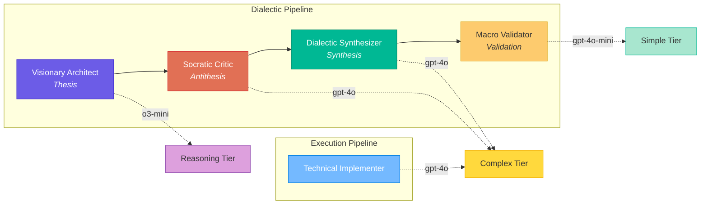
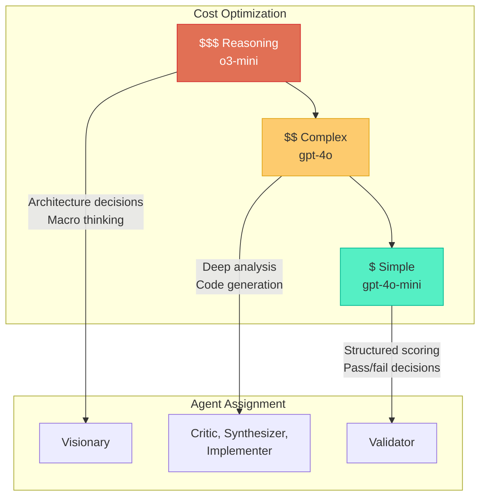

# Agents

Dialectic Crew AI defines five specialized agents, each with a distinct role in the dialectic process. Agents are configured in `src/dialectic/agents.py`.

---

## Agent Overview

---

## Agent Definitions

### 1. Visionary Architect (`visionario`)

| Property | Value |
|----------|-------|
| **Role** | Senior Visionary Architect |
| **Goal** | Propose the most elegant initial solution aligned with the system's macro vision |
| **LLM Tier** | Reasoning (`o3-mini`) |
| **Tools** | None |
| **Phase** | Thesis |

The Visionary generates bold, comprehensive initial proposals. With 18 years of simulated architectural experience, it always reads `VISION.md` first and considers the system holistically: affected modules, non-functional requirements, and the ideal speed-quality tradeoff.

### 2. Socratic Critic (`critico_socratico`)

| Property | Value |
|----------|-------|
| **Role** | Relentless Socratic Critic |
| **Goal** | Rigorously evaluate whether the implementation meets what was requested, without expanding scope |
| **LLM Tier** | Complex (`gpt-4o`) |
| **Tools** | None |
| **Phase** | Antithesis |

The Critic is the devil's advocate. Its fundamental rule is to evaluate **only** what the task requests — never expanding scope. It checks for:
- Point-by-point task fulfillment
- Contradictions with `VISION.md`
- Overscope (doing more than requested)
- Technical bugs or errors
- Fair scoring within the task's scope

### 3. Dialectic Synthesizer (`sintetizador`)

| Property | Value |
|----------|-------|
| **Role** | Dialectic Synthesizer |
| **Goal** | Transform thesis + antithesis into a superior version, eliminating ALL weaknesses |
| **LLM Tier** | Complex (`gpt-4o`) |
| **Tools** | None |
| **Phase** | Synthesis |

The Synthesizer is "Hegel in code form." It receives both the proposal and the critiques, producing a synthesis that:
- Preserves the thesis's strengths
- Incorporates all critiques from the antithesis
- Eliminates all identified weaknesses
- Resolves contradictions creatively

The synthesis is not a mediocre middle ground — it is a **dialectical transcendence**.

### 4. Macro & Quality Validator (`validador_macro`)

| Property | Value |
|----------|-------|
| **Role** | Macro & Quality Validator |
| **Goal** | Assign a final score of 0–10 and decide whether to approve or force a retry |
| **LLM Tier** | Simple (`gpt-4o-mini`) |
| **Tools** | None |
| **Phase** | Validation |

The Validator is the final gate. It always reads `VISION.md` for comparison and scores against a checklist:

1. Feature aligned with macro vision?
2. Affected modules considered?
3. Risks mitigated?
4. Non-functional requirements covered?
5. User stories consistent and complete?
6. 5+ anti-drift questions answered?
7. Zero contradictions with VISION.md?

If score < 9.0, it explains exactly what needs improvement.

### 5. Technical Implementer (`implementer`)

| Property | Value |
|----------|-------|
| **Role** | Technical Implementer |
| **Goal** | Execute the task as described, generating code/config/files aligned with VISION.md |
| **LLM Tier** | Complex (`gpt-4o`) |
| **Tools** | FileReadTool, FileWriterTool |
| **Phase** | Thesis (in execution context) |

The Implementer executes tasks during the execution phase. It:
- Reads `VISION.md` before implementing
- Uses file tools to create and modify files
- Implements exactly what is asked (no overscope)
- Documents changes clearly

---

## LLM Tier Strategy

| Tier | Model | Cost | Used By | Rationale |
|------|-------|------|---------|-----------|
| **Reasoning** | `o3-mini` | High | Visionary | Architecture and macro decisions need the strongest reasoning |
| **Complex** | `gpt-4o` | Medium | Critic, Synthesizer, Implementer | Critique, synthesis, and implementation require nuanced understanding |
| **Simple** | `gpt-4o-mini` | Low | Validator | Validation is structured scoring — a simpler model suffices |

All tiers are configurable via environment variables (`LLM_MODEL_REASONING`, `LLM_MODEL_COMPLEX`, `LLM_MODEL_SIMPLE`).

---

## Dynamically Created Agents

In addition to the five persistent agents, two agents are created dynamically during task execution:

### Independent Verifier

Created in `TaskExecutionFlow.verify_implementation()` (Phase A+B):

| Property | Value |
|----------|-------|
| **Role** | Independent Verifier |
| **LLM** | Same as Validator |
| **Tools** | FileReadTool |
| **Special** | `reasoning=True`, `max_reasoning_attempts=2` |

Reads actual project files to verify that artifacts described by the task actually exist. Has no access to the dialectic context.

### Independent Reimplementer

Created in `TaskExecutionFlow.independent_reimplement()` (Phase C):

| Property | Value |
|----------|-------|
| **Role** | Independent Implementer |
| **LLM** | Same as Implementer |
| **Tools** | FileReadTool, FileWriterTool |
| **Special** | `reasoning=True`, `max_reasoning_attempts=2` |

A fresh agent with no prior context that focuses specifically on fixing the checks that failed during verification.

---

## Common Configuration

All agents share these settings:

| Setting | Value | Purpose |
|---------|-------|---------|
| `allow_delegation` | `False` | Prevents agents from delegating to each other |
| `verbose` | `True` | Enables detailed output for debugging |
| `timeout` | 900s (default) | Per-request LLM timeout |
