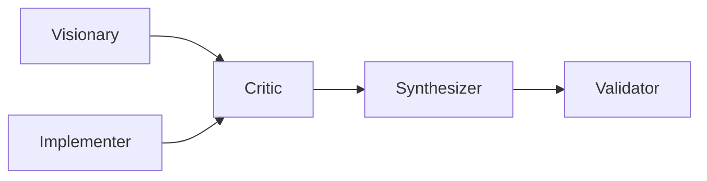

# Agents

Dialectic Crew AI defines **five core agent factories** in `src/dialectic/agents.py`. Each factory returns a fresh `Agent` instance so crews do not leak state across runs.

Those shared factories are now backed by declarative YAML in `src/dialectic/config/agents.yaml`. The runtime factory code still owns LLM-tier binding, tool and MCP bundle resolution, and vision-aware interpolation.

The same module also exports `vision_knowledge(context)`, which attaches the active vision document as a CrewAI `TextFileKnowledgeSource`.

## Vision knowledge

| Call | Vision file | Typical usage |
|---|---|---|
| `vision_knowledge()` | `knowledge/VISION.md` | Standard PRD, planning, execution, and manual verification |
| `vision_knowledge(VisionContext.SELF)` | `internal/SELF_VISION.md` | `--self` and `self-improve` workflows |

Agents reference `VISION.md` generically in their backstories. The actual file comes from the crew's `knowledge_sources`, not from per-agent prompt branching.

## Declarative agent/task assets

The repository now splits stable text from live runtime wiring:

- `src/dialectic/config/agents.yaml` → shared core personas
- `src/dialectic/config/agents_prioritize.yaml` → prioritization-only personas
- `src/dialectic/config/tasks_prd.yaml` → PRD dialectic tasks
- `src/dialectic/config/tasks_prioritize.yaml` → prioritization debate tasks
- `src/planning/config/tasks.yaml` → planning tasks
- `src/execution/config/tasks_dialectic.yaml` → execution dialectic tasks
- `src/execution/config/tasks_verify.yaml` → standalone verification task

Runtime modules such as `src/dialectic/prd_runtime.py`, `src/dialectic/prioritize_runtime.py`, `src/planning/runtime.py`, `src/execution/runtime.py`, and `src/execution/verify_runtime.py` turn those YAML definitions into live CrewAI objects.

## Agent overview

## Core factories

### `create_visionario()`

| Property | Value |
|---|---|
| Role | Senior Visionary Architect |
| LLM | `LLM_MODEL_REASONING` (`o3-mini` by default) |
| Reasoning | Enabled, `max_reasoning_attempts=3` |
| CrewAI tools | `FileReadTool`, `DirectoryReadTool`, optional `CodeDocsSearchTool` |
| MCPs | Context7, Brave Search, Skills MCP |

Use case: first-pass thesis generation and high-level architecture reasoning.

### `create_critico_socratico()`

| Property | Value |
|---|---|
| Role | Relentless Socratic Critic |
| LLM | `LLM_MODEL_COMPLEX` (`gpt-4o` by default) |
| Reasoning | Enabled, `max_reasoning_attempts=2` |
| CrewAI tools | none |
| MCPs | Sequential Thinking, Skills MCP |

Use case: strict scope checking, contradiction hunting, overscope detection, and fair scoring within the requested task.

### `create_sintetizador()`

| Property | Value |
|---|---|
| Role | Dialectic Synthesizer |
| LLM | `LLM_MODEL_COMPLEX` |
| Reasoning | Enabled, `max_reasoning_attempts=2` |
| CrewAI tools | none |
| MCPs | Context7, Skills MCP |

Use case: merges thesis + critique into an improved synthesis.

### `create_validador_macro()`

| Property | Value |
|---|---|
| Role | Macro & Quality Validator |
| LLM | `LLM_MODEL_SIMPLE` (`gpt-4o-mini` by default) |
| Reasoning | not explicitly enabled |
| CrewAI tools | `FileReadTool`, `DirectoryReadTool`, optional `JSONSearchTool` |
| MCPs | none |

Use case: final quality gate, structured scoring, and retry decisions.

### `create_implementer()`

| Property | Value |
|---|---|
| Role | Technical Implementer |
| LLM | `LLM_MODEL_COMPLEX` |
| CrewAI tools | `FileReadTool`, `FileWriterTool`, `DirectoryReadTool` |
| MCPs | Context7, Brave Search, Skills MCP |

Use case: execution-phase implementation and concrete file changes.

## MCP wiring

The helper `_make_mcp()` conditionally creates MCP servers and returns `None` when prerequisites are missing. Agent factories then filter `None` values out of `mcps=[...]`.

### Available MCP servers

| Server | Transport | Requirements | Wired into |
|---|---|---|---|
| `mcp_context7` | HTTP | `CONTEXT7_API_KEY` | Visionary, Synthesizer, Implementer |
| `mcp_brave_search` | stdio via Docker | `BRAVE_API_KEY` + `docker` | Visionary, Implementer |
| `mcp_sequential_thinking` | stdio via Docker | `docker` | Critic |
| `mcp_skills` | local stdio Python process | importable `src.mcp.skills_mcp` module | Visionary, Critic, Synthesizer, Implementer |

### Skills MCP details

`src/mcp/skills_mcp.py` serves local `SKILL.md` files backed by `SkillIndex` from `src/mcp/skills_index.py`.

Discovery roots:

- `src/mcp/skills`
- `~/.agents/skills`
- `~/.cursor/skills-cursor`

Exposed surfaces:

- `skills_list_skills`
- `skills_get_skill`
- `skills_search_skills`
- `skills://{skill_id}` resource URIs

By default the skills server runs over **stdio**. It can also serve streamable HTTP when `SKILLS_MCP_TRANSPORT=streamable_http` or when launched with `--http` / `--streamable-http`.

## Tooling summary

| Tool | Initialization | Used by |
|---|---|---|
| `FileReadTool` | always attempted | Visionary, Validator, Implementer, dynamic verification agents |
| `FileWriterTool` | always attempted | Implementer, dynamic reimplementer |
| `DirectoryReadTool` | always attempted | Visionary, Validator, Implementer, dynamic agents |
| `JSONSearchTool` | optional | Validator |
| `CodeDocsSearchTool` | optional | Visionary |

Optional CrewAI tools degrade gracefully when their dependencies are unavailable.

## Dynamically created execution agents

Beyond the five core factories, execution creates two short-lived agents in `src/execution/task_flow.py`:

- **Independent Verifier** — file-reading verifier used after dialectic execution
- **Independent Reimplementer** — fresh implementer used only when verification fails

Those agents are intentionally isolated from the earlier dialectic context so verification is less self-congratulatory. A rare and beautiful trait in both humans and software.

Standalone verification in `src/execution/verify.py` now reuses the shared `create_validador_macro()` factory through `src/execution/verify_runtime.py`, applying a narrow read-only tool override instead of defining a second validator persona.

Prioritization likewise uses dedicated YAML-backed personas in `src/dialectic/config/agents_prioritize.yaml`, instantiated by `src/dialectic/prioritize_runtime.py` for the analyst/critic/ranker debate.