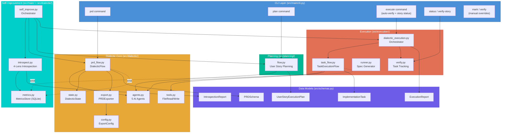
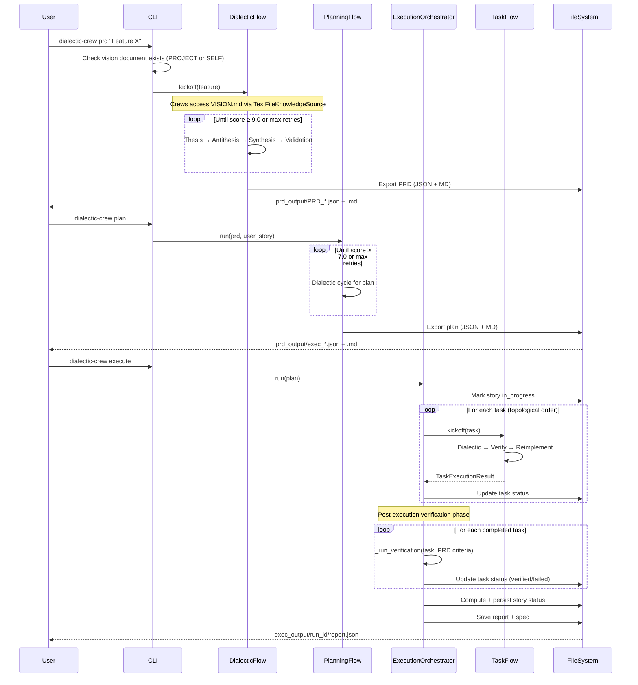
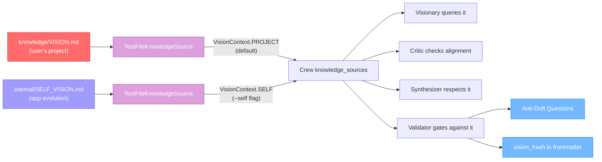
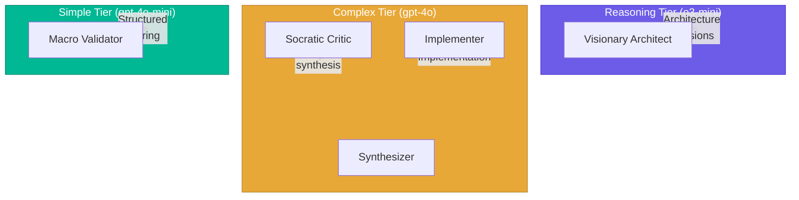
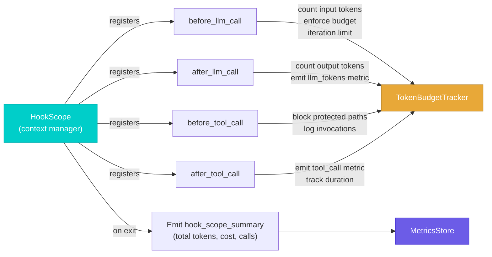

# Architecture

This document describes the system architecture of Dialectic Crew AI, how modules connect, and the key design decisions.

---

## System Overview

---

## Module Responsibilities

### `src/schemas.py` — Source of Truth

All Pydantic data models live here. Every module imports from this single file, ensuring consistent data structures throughout the system.

### `src/dialectic/` — Core Engine

| File | Responsibility |
|------|---------------|
| `agents.py` | Agent factory functions (5 agents with LLM tiers, MCP servers, tools) + `vision_knowledge(context)` for RAG-based vision access (supports dual vision contexts via `VisionContext`) |
| `prd_flow.py` | Main `DialecticFlow` (CrewAI Flow) for PRD generation with retry and lazy SQLite persistence |
| `state.py` | `DialecticState` Pydantic model for flow state management (feature objective, file attachments) |
| `config.py` | `ExportConfig` loader with pydantic-settings + fallback |
| `export.py` | `PRDExporter` (JSON+MD), markdown rendering, consistency validation |
| `tools.py` | CrewAI tools (FileRead, FileWrite, DirectoryRead, JSONSearch, CodeDocs) used by agents |

### `src/planning/` — User Story Planning

| File | Responsibility |
|------|---------------|
| `flow.py` | Dialectic cycle for producing `UserStoryExecutionPlan` from a PRD user story |

### `src/execution/` — Plan Execution

| File | Responsibility |
|------|---------------|
| `dialectic_execution.py` | Orchestrates `TaskExecutionFlow` per task with topological sort and dependency failure propagation, runs post-execution PRD verification, computes and persists user story status |
| `task_flow.py` | Per-task CrewAI Flow: dialectic → verify → reimplement |
| `runner.py` | Generates spec Markdown from a plan (no LLM, static) |
| `verify.py` | Task/story status tracking and display, reusable LLM verification core (`_run_verification`), story-level verification (`verify_user_story`), manual overrides (`mark_task`, `verify_task`) |

### `src/dialectic/metrics.py` — Passive Metrics Store

SQLite-backed store that records timestamped metric events. Flows and guardrails emit metrics passively (fire-and-forget) without changing any behavior. Provides `query()` and `trend()` for the introspection engine.

### `src/dialectic/introspect.py` — Introspection Engine

Analyses the app through 4 lenses: vision gap (unchecked SELF_VISION.md items), metric trends (declining scores, rising retries), code health (TODOs, test count), and failure patterns (recurring guardrail rejections). Produces an `IntrospectionReport` with ranked `ImprovementOpportunity` items.

### `src/main/self_improve.py` — Self-Improvement Orchestrator

Wires introspection + existing PRD/plan/execute commands + safety gates into a semi-autonomous improvement cycle. Steps: baseline test snapshot → introspect → generate PRD → plan → execute → validate (tests + metrics) → create PR. All changes happen on isolated git branches; the human always reviews.

### `src/main/cli.py` — Command-Line Interface

Parses CLI arguments and dispatches to the appropriate module. Primary commands: `prd`, `plan`, `execute`, `status`, `verify-story`, `self-improve`. Manual overrides: `mark`, `verify`.

---

## Data Flow

---

## Design Decisions

### 1. Dialectics as Core Pattern

Every generative step (PRD, planning, execution) follows the same four-phase pattern. This isn't optional — the Validator agent is the sole approval gate, and proposals loop until they reach the quality threshold.

### 2. Anti-Drift Mechanism

The system supports two vision contexts: `VisionContext.PROJECT` (default) loads `knowledge/VISION.md` for user projects, while `VisionContext.SELF` loads `internal/SELF_VISION.md` for self-improvement. The context is determined by the `--self` CLI flag and flows through state objects to the Crew's `knowledge_sources`. Relevant sections of the active vision document are automatically surfaced to agents via semantic chunking and vector retrieval, rather than injecting the full document text. Anti-drift questions are mandatory in every PRD. The exported Markdown includes a SHA-256 hash of the vision file, enabling automated drift detection.

### 3. Tiered LLM Strategy

Expensive reasoning models handle architecture; mid-tier handles implementation and critique; cheap models handle structured validation. This optimizes cost while maintaining quality.

### 4. Atomic Export with Rollback

When exporting "both" formats, JSON is written first (safe for pipelines). If Markdown writing fails, the JSON file is automatically rolled back (deleted) and an exception is raised.

### 5. Conditional MCP Loading

MCP (Model Context Protocol) servers are loaded only when their prerequisites are met. The `_make_mcp()` helper checks for required environment variables and system commands (e.g., Docker) before instantiation. Missing prerequisites cause the server to be `None`, which is filtered from agent `mcps=` lists. This prevents runtime errors when API keys or Docker are unavailable.

### 6. Graceful Degradation

If CrewAI's `output_pydantic` fails to produce structured output, the system falls back to regex-based JSON extraction from raw text. If that also fails, placeholder objects are created and the flow continues.

### 7. SQLite Flow Persistence (Lazy)

Both `DialecticFlow` and `TaskExecutionFlow` use `SQLiteFlowPersistence` from CrewAI. Persistence is lazily initialized on first use (not at module import) to avoid side effects during imports or testing. Flow state is persisted to a local SQLite database, enabling recovery after interruptions and providing an audit trail of dialectic iterations.

### 8. Crew Planning and Memory

Crews are configured with `planning=True` and `memory=True`. CrewAI's built-in planning step (using `LLM_MODEL_PLANNING`) generates a plan before agents execute, improving task coordination. Memory enables agents to learn from earlier interactions within a crew run.

### 9. Topological Sort with Dependency Propagation

Tasks with dependencies are ordered using a topological sort algorithm. If cycles are detected (invalid state), the system falls back to ordering by the `order` field. Tasks whose dependencies have failed are automatically skipped and marked as failed, preventing cascading wasted LLM calls.

### 10. Automated Post-Execution Verification

The execution flow does not trust its own dialectic score as the final word. After all tasks complete, an independent post-execution verification phase re-checks each completed task against PRD acceptance criteria using a separate LLM agent with file-reading tools. This provides a "second opinion" that catches cases where the dialectic cycle approved work that doesn't actually meet the acceptance criteria in the codebase. The verification core (`_run_verification`) is shared between the automated flow and the manual CLI commands (`verify`, `verify-story`), ensuring consistent behavior.

### 11. User Story-Level Status Tracking

User story status is computed automatically from task verification results and persisted in the plan JSON alongside task-level statuses. This closes the tracking loop: the plan file is the single source of truth for both task and story completion, eliminating the need to cross-reference separate report files. CLI commands (`status`, `verify-story`) and the execution flow all read and write status through the same `verify.py` functions.

### 12. Agent Factory Functions

Agents are defined as factory functions (`create_visionario()`, `create_critico_socratico()`, etc.) rather than module-level singletons. Each call returns a fresh `Agent` instance, preventing cross-flow memory contamination when `memory=True`. The `vision_knowledge(context)` factory creates a `TextFileKnowledgeSource` pointing to the appropriate vision document (`knowledge/VISION.md` or `internal/SELF_VISION.md`) based on the `VisionContext` parameter.

### 13. RAG-Based Vision Access

Instead of injecting the full `VISION.md` text into every task description (which was repeated 4 times per dialectic round), the system uses CrewAI's `TextFileKnowledgeSource` for semantic chunking and vector retrieval. Each Crew is configured with `knowledge_sources=[vision_knowledge(context)]`, and agents receive only the vision sections relevant to their current query context.

### 14. Dual Vision Architecture

The system separates the app's own evolution vision from user project visions:

- `internal/SELF_VISION.md` — the app's private roadmap, phases, and design principles
- `knowledge/VISION.md` — the user's project vision (ships as a customizable template)

A `VisionContext` enum in `vision.py` determines which document to load. All vision-related functions (`get_vision_path`, `ensure_vision_path`, `get_vision_hash`, `vision_knowledge`) accept an optional context parameter defaulting to `PROJECT`. The `--self` CLI flag activates `VisionContext.SELF`.

Agent backstories reference "VISION.md" generically — they consult whatever vision document the Crew loaded into its `knowledge_sources`. This means the context switch happens at one point (`vision_knowledge(context)`), not in every agent definition.

### 15. Passive Metrics Collection

The metrics store (`MetricsStore`) uses SQLite in WAL mode for thread-safe, lock-free reads during writes. Metrics are emitted passively via `emit()` — a fire-and-forget function that catches all exceptions. PRD flows emit `prd_score` and `prd_retry_count`; task flows emit `task_score` and `task_retry_count`; guardrails emit `guardrail_reject` with reason context. No behavior is altered by metric emission.

### 16. 4-Lens Introspection

The introspection engine analyses the app through four independent lenses, each producing `ImprovementOpportunity` items:

1. **Vision gap**: Parses `[ ]` / `[x]` checkboxes in `SELF_VISION.md`
2. **Metric trends**: Queries the metrics store for declining quality or rising retries
3. **Code health**: Counts TODO/FIXME markers, discovers test inventory
4. **Failure patterns**: Analyses recurring guardrail rejection patterns

Opportunities are sorted by estimated impact (high → medium → low), giving the self-improvement cycle a prioritized backlog.

### 17. Self-Improvement Safety Mechanisms

The self-improvement orchestrator enforces multiple safety gates:

- **Immutable files**: `internal/SELF_VISION.md`, `self_improve.py`, `metrics.py`, and `introspect.py` are protected — the orchestrator cannot modify its own safety logic
- **Baseline gate**: If tests fail before the cycle starts, it aborts immediately
- **Test gate**: Absolute — after execution, all tests must pass or the branch is discarded
- **Metric gate**: No metric can decrease by more than 5% (configurable via `MIN_METRIC_RETENTION`)
- **Token budget gate**: The entire self-improve cycle is wrapped in a `HookScope` with a configurable token budget (`SELF_IMPROVE_TOKEN_BUDGET`, default 500K). If budget is exceeded mid-cycle, the branch is discarded
- **Iteration cap**: `--max` limits improvements per cycle (default: 1) to limit blast radius
- **LLM iteration cap**: Each agent is limited to `SELF_IMPROVE_MAX_ITERATIONS` LLM calls (default: 25) per task
- **Branch isolation**: All changes happen on `self-improve/<timestamp>` branches
- **Human gate**: PRs are created via `gh`, never auto-merged
- **Bootstrap paradox prevention**: The orchestrator is on the immutable-files list, so it cannot improve itself

### 18. Execution Hooks Infrastructure

The system uses CrewAI's native hook mechanism for fine-grained control over LLM and tool calls:

**TokenBudgetTracker** (`src/dialectic/hooks.py`): Thread-safe class that tracks input/output token counts and estimated cost. Token counting uses `tiktoken` with `cl100k_base` encoding (industry-standard approximation across providers).

**HookScope** (`src/dialectic/hooks.py`): Context manager that registers all 4 hooks on enter, unregisters on exit, and emits a summary metric. Supports nesting (inner scopes restore the outer scope on exit). Used in:
- `self_improve.py`: Wraps the entire cycle with budget enforcement and protected paths
- `prd_flow.py`: Wraps each PRD generation for per-PRD cost tracking
- `task_flow.py`: Wraps each task execution for per-task cost tracking

**Protected path enforcement**: The `before_tool_call` hook inspects write tool invocations and blocks any attempt to modify files in the `PROTECTED_PATHS` set (e.g., `internal/SELF_VISION.md`, `self_improve.py`).

### 19. Dialectic Prioritization

Instead of simple impact-based sorting, the self-improvement cycle runs a 3-agent dialectic debate to prioritize improvement opportunities:

1. **Strategic Analyst**: Evaluates each opportunity for SELF_VISION alignment, evidence strength, and ROI
2. **Feasibility Critic**: Challenges with implementation complexity, dependency risks, and scope creep
3. **Priority Ranker**: Synthesizes thesis + antithesis into a final ranked list with scores

This produces a `PrioritizationResult` with scored and justified rankings. On failure, the system gracefully degrades to simple impact sorting.

---

## Technology Stack

| Component | Technology |
|-----------|-----------|
| Runtime | Python 3.10–3.13 |
| Agent Framework | CrewAI (Flow API, Crew, Tasks, Agents) |
| Tool Integration | MCP (Model Context Protocol) via `crewai.mcp` |
| Data Validation | Pydantic v2 |
| LLM Integration | LiteLLM (via CrewAI) |
| State Persistence | SQLite (via CrewAI `SQLiteFlowPersistence`) |
| Token Counting | tiktoken (cl100k_base encoding) |
| Configuration | pydantic-settings + python-dotenv |
| Build System | setuptools + pyproject.toml |
| Package Manager | uv (recommended) |
| Container Runtime | Docker (optional, for MCP Stdio servers) |
