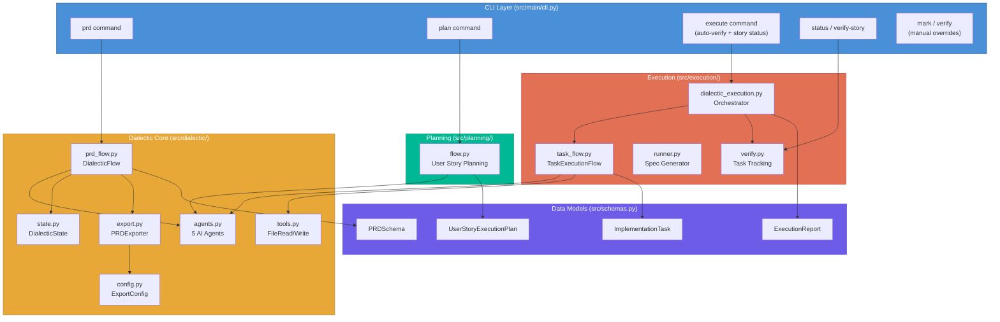
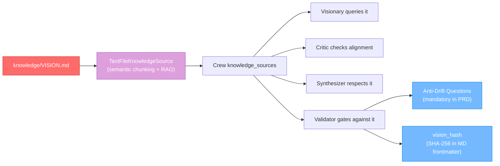
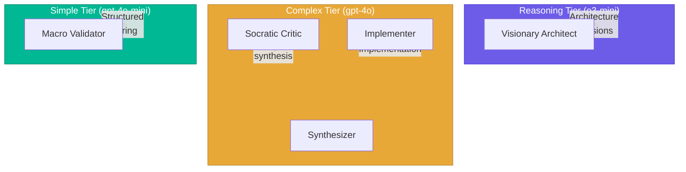

# Architecture

This document describes the system architecture of Dialectic Crew AI, how modules connect, and the key design decisions.

---

## System Overview

---

## Module Responsibilities

### `src/schemas.py` — Source of Truth

All Pydantic data models live here. Every module imports from this single file, ensuring consistent data structures throughout the system.

### `src/dialectic/` — Core Engine

| File | Responsibility |
|------|---------------|
| `agents.py` | Agent factory functions (5 agents with LLM tiers, MCP servers, tools) + `vision_knowledge()` for RAG-based VISION.md access |
| `prd_flow.py` | Main `DialecticFlow` (CrewAI Flow) for PRD generation with retry and lazy SQLite persistence |
| `state.py` | `DialecticState` Pydantic model for flow state management (feature objective, file attachments) |
| `config.py` | `ExportConfig` loader with pydantic-settings + fallback |
| `export.py` | `PRDExporter` (JSON+MD), markdown rendering, consistency validation |
| `tools.py` | CrewAI tools (FileRead, FileWrite, DirectoryRead, JSONSearch, CodeDocs) used by agents |

### `src/planning/` — User Story Planning

| File | Responsibility |
|------|---------------|
| `flow.py` | Dialectic cycle for producing `UserStoryExecutionPlan` from a PRD user story |

### `src/execution/` — Plan Execution

| File | Responsibility |
|------|---------------|
| `dialectic_execution.py` | Orchestrates `TaskExecutionFlow` per task with topological sort and dependency failure propagation, runs post-execution PRD verification, computes and persists user story status |
| `task_flow.py` | Per-task CrewAI Flow: dialectic → verify → reimplement |
| `runner.py` | Generates spec Markdown from a plan (no LLM, static) |
| `verify.py` | Task/story status tracking and display, reusable LLM verification core (`_run_verification`), story-level verification (`verify_user_story`), manual overrides (`mark_task`, `verify_task`) |

### `src/main/cli.py` — Command-Line Interface

Parses CLI arguments and dispatches to the appropriate module. Primary commands: `prd`, `plan`, `execute`, `status`, `verify-story`. Manual overrides: `mark`, `verify`.

---

## Data Flow

---

## Design Decisions

### 1. Dialectics as Core Pattern

Every generative step (PRD, planning, execution) follows the same four-phase pattern. This isn't optional — the Validator agent is the sole approval gate, and proposals loop until they reach the quality threshold.

### 2. Anti-Drift Mechanism

All agents access `knowledge/VISION.md` via CrewAI's `TextFileKnowledgeSource`, which provides semantic chunking and vector retrieval. Relevant sections of the vision are automatically surfaced to agents based on query context, rather than injecting the full document text. Anti-drift questions are mandatory in every PRD. The exported Markdown includes a SHA-256 hash of the vision file, enabling automated drift detection.

### 3. Tiered LLM Strategy

Expensive reasoning models handle architecture; mid-tier handles implementation and critique; cheap models handle structured validation. This optimizes cost while maintaining quality.

### 4. Atomic Export with Rollback

When exporting "both" formats, JSON is written first (safe for pipelines). If Markdown writing fails, the JSON file is automatically rolled back (deleted) and an exception is raised.

### 5. Conditional MCP Loading

MCP (Model Context Protocol) servers are loaded only when their prerequisites are met. The `_make_mcp()` helper checks for required environment variables and system commands (e.g., Docker) before instantiation. Missing prerequisites cause the server to be `None`, which is filtered from agent `mcps=` lists. This prevents runtime errors when API keys or Docker are unavailable.

### 6. Graceful Degradation

If CrewAI's `output_pydantic` fails to produce structured output, the system falls back to regex-based JSON extraction from raw text. If that also fails, placeholder objects are created and the flow continues.

### 7. SQLite Flow Persistence (Lazy)

Both `DialecticFlow` and `TaskExecutionFlow` use `SQLiteFlowPersistence` from CrewAI. Persistence is lazily initialized on first use (not at module import) to avoid side effects during imports or testing. Flow state is persisted to a local SQLite database, enabling recovery after interruptions and providing an audit trail of dialectic iterations.

### 8. Crew Planning and Memory

Crews are configured with `planning=True` and `memory=True`. CrewAI's built-in planning step (using `LLM_MODEL_PLANNING`) generates a plan before agents execute, improving task coordination. Memory enables agents to learn from earlier interactions within a crew run.

### 9. Topological Sort with Dependency Propagation

Tasks with dependencies are ordered using a topological sort algorithm. If cycles are detected (invalid state), the system falls back to ordering by the `order` field. Tasks whose dependencies have failed are automatically skipped and marked as failed, preventing cascading wasted LLM calls.

### 10. Automated Post-Execution Verification

The execution flow does not trust its own dialectic score as the final word. After all tasks complete, an independent post-execution verification phase re-checks each completed task against PRD acceptance criteria using a separate LLM agent with file-reading tools. This provides a "second opinion" that catches cases where the dialectic cycle approved work that doesn't actually meet the acceptance criteria in the codebase. The verification core (`_run_verification`) is shared between the automated flow and the manual CLI commands (`verify`, `verify-story`), ensuring consistent behavior.

### 11. User Story-Level Status Tracking

User story status is computed automatically from task verification results and persisted in the plan JSON alongside task-level statuses. This closes the tracking loop: the plan file is the single source of truth for both task and story completion, eliminating the need to cross-reference separate report files. CLI commands (`status`, `verify-story`) and the execution flow all read and write status through the same `verify.py` functions.

### 12. Agent Factory Functions

Agents are defined as factory functions (`create_visionario()`, `create_critico_socratico()`, etc.) rather than module-level singletons. Each call returns a fresh `Agent` instance, preventing cross-flow memory contamination when `memory=True`. The `vision_knowledge()` factory creates a `TextFileKnowledgeSource` pointing to `knowledge/VISION.md` via CrewAI's standard knowledge directory convention.

### 13. RAG-Based Vision Access

Instead of injecting the full `VISION.md` text into every task description (which was repeated 4 times per dialectic round), the system uses CrewAI's `TextFileKnowledgeSource` for semantic chunking and vector retrieval. Each Crew is configured with `knowledge_sources=[vision_knowledge()]`, and agents receive only the vision sections relevant to their current query context.

---

## Technology Stack

| Component | Technology |
|-----------|-----------|
| Runtime | Python 3.10–3.13 |
| Agent Framework | CrewAI (Flow API, Crew, Tasks, Agents) |
| Tool Integration | MCP (Model Context Protocol) via `crewai.mcp` |
| Data Validation | Pydantic v2 |
| LLM Integration | LiteLLM (via CrewAI) |
| State Persistence | SQLite (via CrewAI `SQLiteFlowPersistence`) |
| Configuration | pydantic-settings + python-dotenv |
| Build System | setuptools + pyproject.toml |
| Package Manager | uv (recommended) |
| Container Runtime | Docker (optional, for MCP Stdio servers) |
