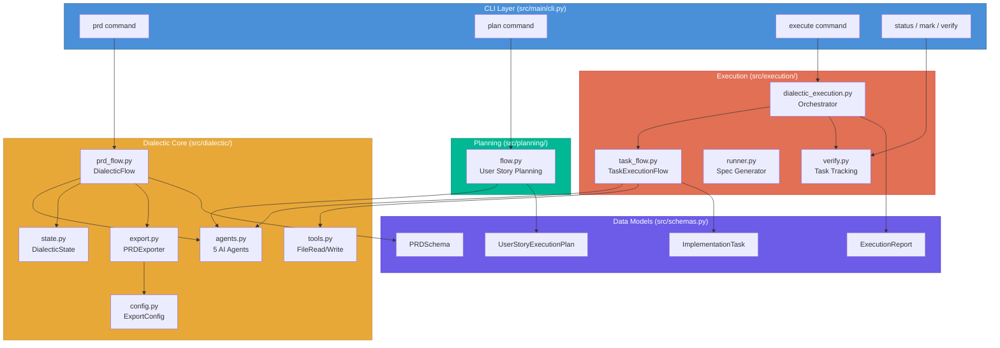
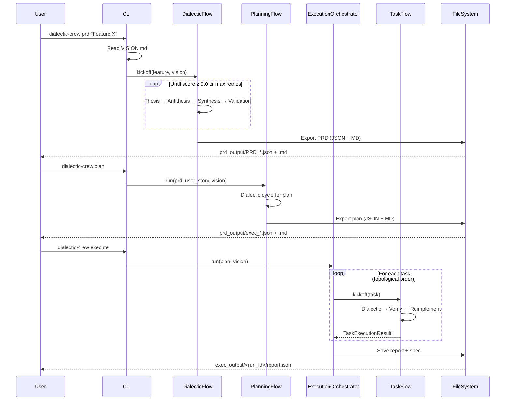
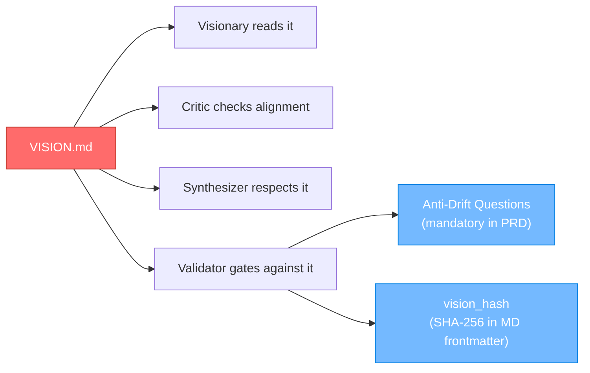
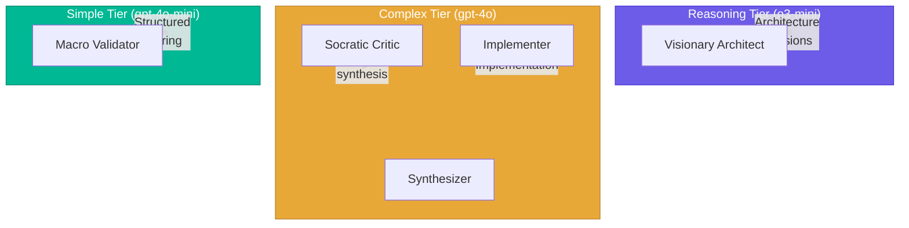

# Architecture

This document describes the system architecture of Dialectic Crew AI, how modules connect, and the key design decisions.

---

## System Overview

---

## Module Responsibilities

### `src/schemas.py` — Source of Truth

All Pydantic data models live here. Every module imports from this single file, ensuring consistent data structures throughout the system.

### `src/dialectic/` — Core Engine

| File | Responsibility |
|------|---------------|
| `agents.py` | Defines 5 CrewAI agents with LLM tier assignments |
| `prd_flow.py` | Main `DialecticFlow` (CrewAI Flow) for PRD generation with retry |
| `state.py` | `DialecticState` Pydantic model for flow state management |
| `config.py` | `ExportConfig` loader with pydantic-settings + fallback |
| `export.py` | `PRDExporter` (JSON+MD), markdown rendering, consistency validation |
| `tools.py` | CrewAI tools (FileRead, FileWrite, JSONSearch) used by agents |

### `src/planning/` — User Story Planning

| File | Responsibility |
|------|---------------|
| `flow.py` | Dialectic cycle for producing `UserStoryExecutionPlan` from a PRD user story |

### `src/execution/` — Plan Execution

| File | Responsibility |
|------|---------------|
| `dialectic_execution.py` | Orchestrates `TaskExecutionFlow` per task with topological sort |
| `task_flow.py` | Per-task CrewAI Flow: dialectic → verify → reimplement |
| `runner.py` | Generates spec Markdown from a plan (no LLM, static) |
| `verify.py` | Task status tracking, display, manual marking, LLM verification |

### `src/main/cli.py` — Command-Line Interface

Parses CLI arguments and dispatches to the appropriate module. Six commands: `prd`, `plan`, `execute`, `status`, `mark`, `verify`.

---

## Data Flow

---

## Design Decisions

### 1. Dialectics as Core Pattern

Every generative step (PRD, planning, execution) follows the same four-phase pattern. This isn't optional — the Validator agent is the sole approval gate, and proposals loop until they reach the quality threshold.

### 2. Anti-Drift Mechanism

All agents are instructed to read `VISION.md`. Anti-drift questions are mandatory in every PRD. The exported Markdown includes a SHA-256 hash of the vision file, enabling automated drift detection.

### 3. Tiered LLM Strategy

Expensive reasoning models handle architecture; mid-tier handles implementation and critique; cheap models handle structured validation. This optimizes cost while maintaining quality.

### 4. Atomic Export with Rollback

When exporting "both" formats, JSON is written first (safe for pipelines). If Markdown writing fails, the JSON file is automatically rolled back (deleted) and an exception is raised.

### 5. Graceful Degradation

If CrewAI's `output_pydantic` fails to produce structured output, the system falls back to regex-based JSON extraction from raw text. If that also fails, placeholder objects are created and the flow continues.

### 6. Topological Sort for Task Ordering

Tasks with dependencies are ordered using a topological sort algorithm. If cycles are detected (invalid state), the system falls back to ordering by the `order` field.

---

## Technology Stack

| Component | Technology |
|-----------|-----------|
| Runtime | Python 3.10–3.13 |
| Agent Framework | CrewAI (Flow API, Crew, Tasks, Agents) |
| Data Validation | Pydantic v2 |
| LLM Integration | LiteLLM (via CrewAI) |
| Configuration | pydantic-settings + python-dotenv |
| Build System | setuptools + pyproject.toml |
| Package Manager | uv (recommended) |
