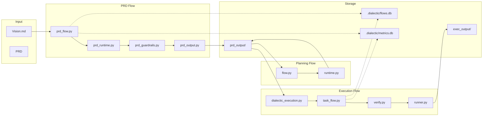
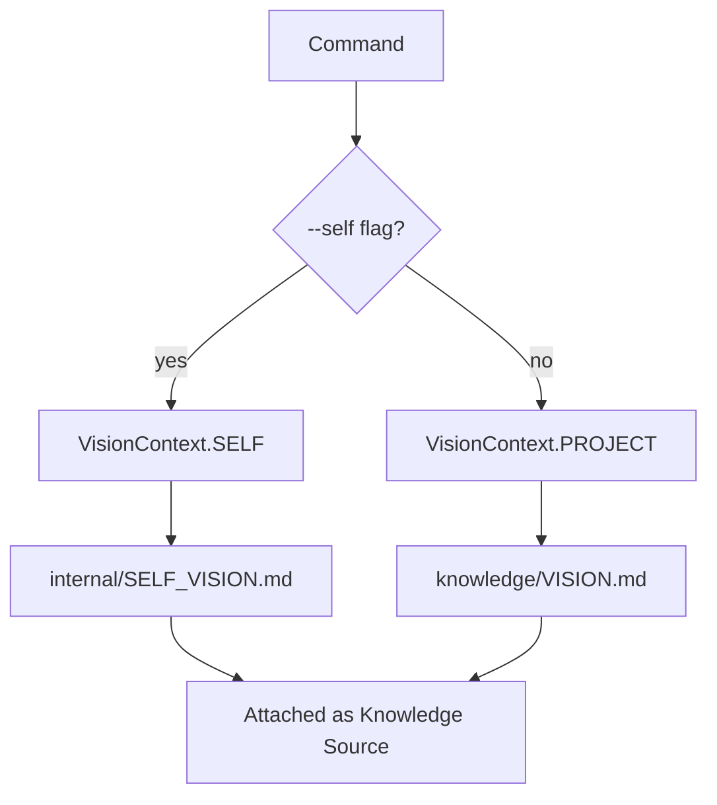
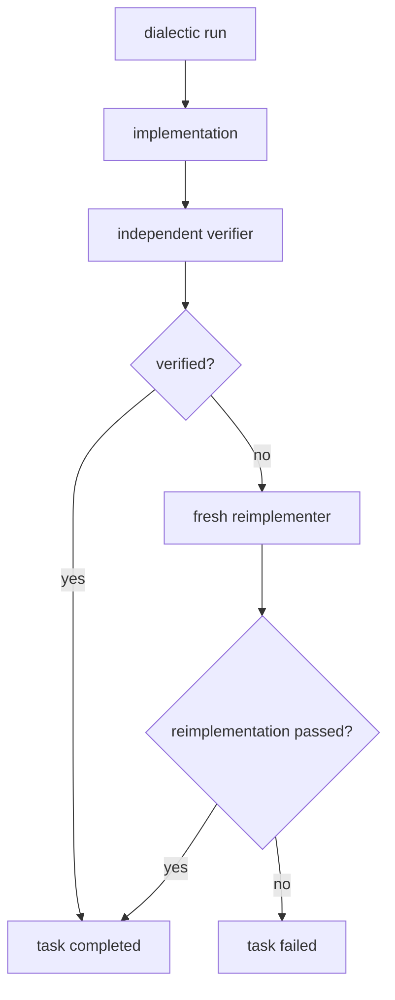
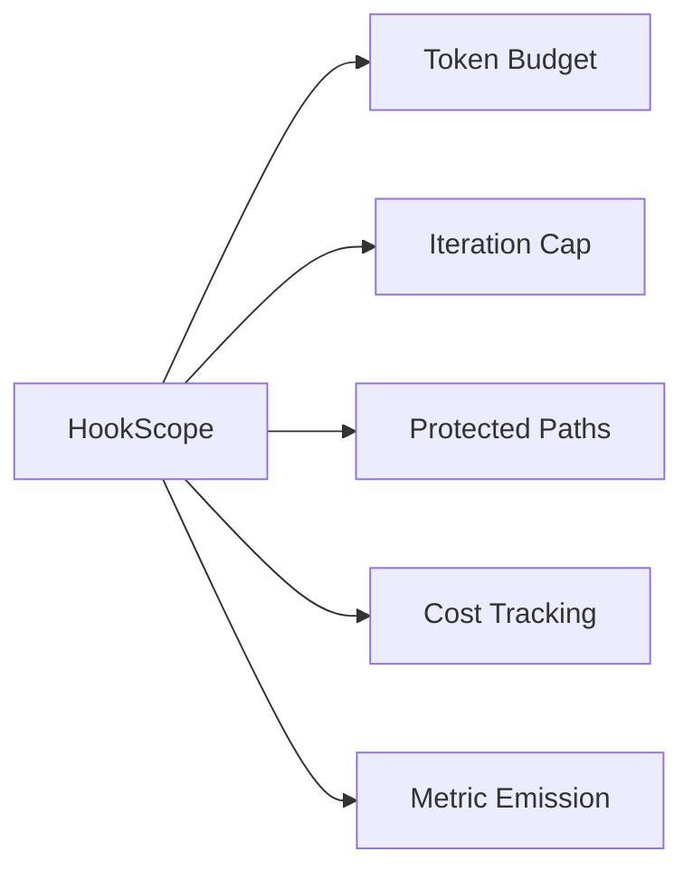
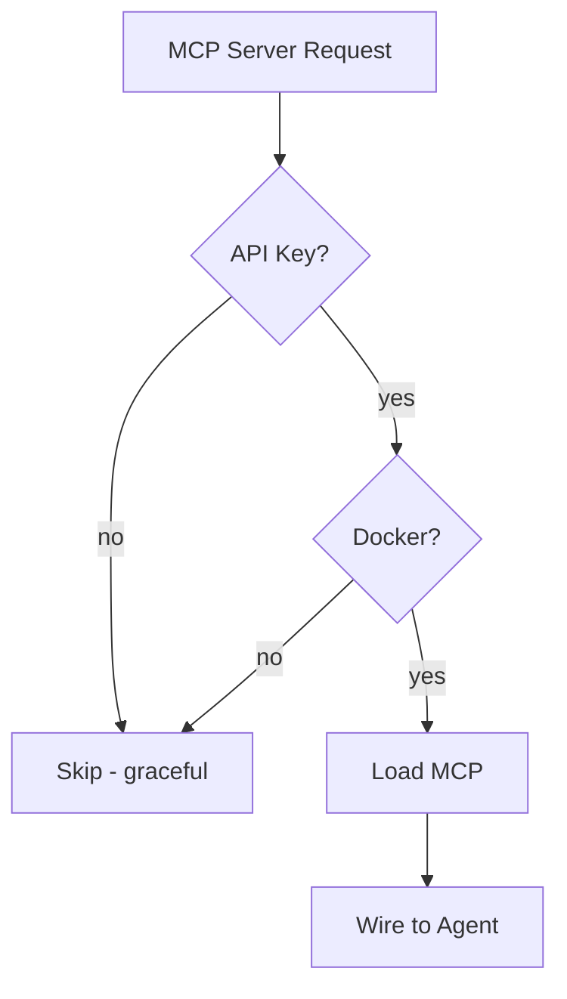
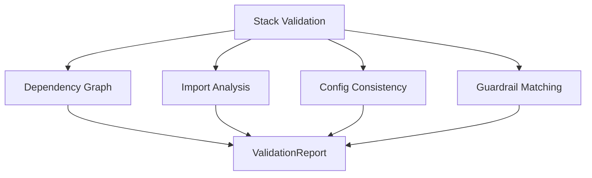
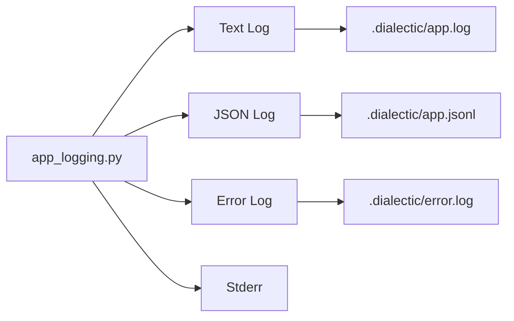
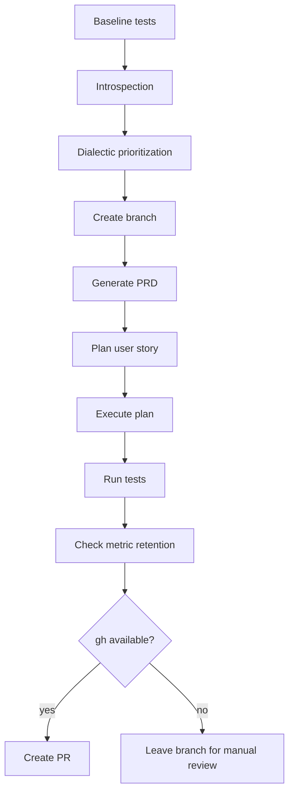
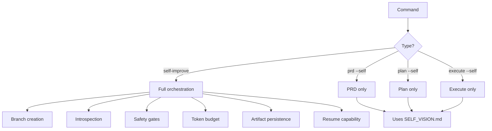

# Architecture

This document describes the current architecture of Dialectic Crew AI as shipped in the repository.

## System overview

```mermaid
graph TB
    subgraph CLI[src/main/cli/entrypoint.py]
        PRD[prd]
        PLAN[plan]
        EXEC[execute]
        STATUS[status / verify-story]
        MANUAL[mark / verify]
        SELF[self-improve]
    end

    subgraph Core[src/dialectic]
        AGENTS[agents.py]
        YAMLCFG[yaml_config.py]
        PRDFLOW[prd_flow.py]
        PRDRT[prd_runtime.py]
        PRDGUARD[prd_guardrails.py]
        PRDOUT[prd_output.py]
        EXPORT[export.py]
        EXPVAL[export_validation.py]
        STATE[state.py]
        HOOKS[hooks.py]
        METRICS[metrics.py]
        TOKTRK[token_tracker.py]
        INTRO[introspect.py]
        PRIOR[prioritize.py]
        PRIORRT[prioritize_runtime.py]
        VISION[vision.py]
        KNOW[knowledge.py]
        DEPGRAPH[dependency_graph.py]
        STACKVAL[stack_validation.py]
        APPLOG[app_logging.py]
        CREWLOG[crewai_event_logger.py]
        CREWRT[crewai_runtime.py]
    end

    subgraph Planning[src/planning]
        PFLOW[flow.py]
        PRT[runtime.py]
    end

    subgraph Execution[src/execution]
        ORCH[dialectic_execution.py]
        TFLOW[task_flow.py]
        TRT[runtime.py]
        VERIFY[verify.py]
        VRT[verify_runtime.py]
        RUNNER[runner.py]
        GUARD[task_guardrails.py]
        REIMPL[task_reimplement_runtime.py]
        TASKVFY[task_verify_runtime.py]
        TOPO[topological_sort.py]
        VALGATE[validation_gate.py]
        CHECK[checkpoint.py]
        CTXB[context_builder.py]
        PLANLD[plan_loader.py]
        StatusMod[status.py]
    end

    subgraph MCP[src/mcp]
        SKIDX[skills_index.py]
        SKMCP[skills_mcp.py]
        SKILLS[skills/]
    end

    subgraph Models[src/schemas.py]
        SCHEMAS[Pydantic schemas]
    end

    PRD --> PRDFLOW
    PLAN --> PFLOW
    EXEC --> ORCH
    STATUS --> VERIFY
    MANUAL --> VERIFY
    SELF --> INTRO
    SELF --> PRIOR
    SELF --> PRDFLOW
    SELF --> PFLOW
    SELF --> ORCH

    PRDFLOW --> AGENTS
    PRDFLOW --> PRDRT
    PRDFLOW --> PRDGUARD
    PRDFLOW --> PRDOUT
    PRDFLOW --> DEPGRAPH
    PRDFLOW --> STACKVAL
    PFLOW --> AGENTS
    PFLOW --> PRT
    TFLOW --> AGENTS
    TFLOW --> TRT
    TFLOW --> GUARD
    TFLOW --> REIMPL
    TFLOW --> TASKVFY
    TFLOW --> TOPO
    TFLOW --> VALGATE
    VERIFY --> VRT
    ORCH --> CTXB
    ORCH --> PLANLD
    ORCH --> CHECK
    ORCH --> StatusMod

    AGENTS --> SKMCP
    SKMCP --> SKIDX
    SKIDX --> SKILLS

    PRDFLOW --> EXPORT
    PRDFLOW --> EXPVAL
    PRDFLOW --> STATE
    PRDFLOW --> METRICS
    PRDFLOW --> TOKTRK
    TFLOW --> METRICS
    TFLOW --> TOKTRK
    INTRO --> METRICS
    SELF --> HOOKS
    HOOKS --> APPLOG

    PRDFLOW --> SCHEMAS
    PFLOW --> SCHEMAS
    TFLOW --> SCHEMAS
    ORCH --> SCHEMAS
    INTRO --> SCHEMAS
```

## Data flow architecture

## Module responsibilities

### `src/dialectic/`

| File | Responsibility |
|---|---|
| `agents.py` | Core agent factories, LLM tier setup, MCP wiring, `vision_knowledge()` |
| `yaml_config.py` | Shared YAML config loader, placeholder rendering, and symbolic schema/guardrail resolution |
| `prd_flow.py` | PRD dialectic flow with retry, export, hooks, and persistence |
| `prd_runtime.py` | YAML-backed PRD crew builder used by `prd_flow.py` |
| `prd_guardrails.py` | Pydantic guardrails for PRD output validation |
| `prd_output.py` | PRD artifact writing (JSON/Markdown) |
| `flow_persistence.py` | Shared CrewAI flow persistence backend selection (`.dialectic/flows.db` by default) |
| `state.py` | Flow state for PRD generation |
| `export.py` | JSON/Markdown export helpers |
| `export_validation.py` | Validation of exported artifacts |
| `config.py` | Export configuration loader |
| `hooks.py` | HookScope, token budgets, protected-path enforcement, cost tracking |
| `metrics.py` | SQLite-backed metrics store, defaulting to `.dialectic/metrics.db` |
| `token_tracker.py` | Token counting and cost estimation |
| `introspect.py` | Four-lens introspection engine |
| `prioritize.py` | Dialectic prioritization for improvement opportunities, plus graceful-degradation fallback |
| `prioritize_runtime.py` | YAML-backed prioritization crew builder kept separate from fallback orchestration |
| `vision.py` | Vision context resolution and project-root helpers |
| `knowledge.py` | Knowledge source management and loading |
| `tools.py` | Shared CrewAI tool setup |
| `tool_bundles.py` | Tool bundle definitions for different agent roles |
| `dependency_graph.py` | Task dependency graph analysis and validation |
| `stack_validation.py` | Stack-aware validation checks for project consistency |
| `app_logging.py` | Centralized rotating logging system |
| `crewai_event_logger.py` | CrewAI event logging and telemetry |
| `crewai_runtime.py` | CrewAI runtime helpers and utilities |
| `llm.py` | LLM client utilities |
| `markdown_renderers.py` | Markdown rendering helpers |
| `mcp_config.py` | MCP configuration handling |
| `prd_exporter.py` | PRD export formatting |
| `crew_builder.py` | Build CrewAI crews from YAML agent/task mappings |
| `crew_log_summarizer.py` | Summarize CrewAI verbose logs for console output |
| `crew_verbose_config.py` | CrewAI verbose and log file configuration from environment |
| `output_paths.py` | PRD and exec output directory resolution by vision context |
| `repo_analyzer.py` | Repository analysis for generated vision documents |
| `vision_generator.py` | Generates VISION.md drafts from repository analysis |
| `target.py` | Active target checkout, registry, and vision path resolution |
| `config/*.yaml` | Shared declarative agent/task templates for core dialectic crews |

### `src/planning/`

| File | Responsibility |
|---|---|
| `flow.py` | User-story planning dialectic with plan export and score thresholding |
| `runtime.py` | YAML-backed planning crew builder |
| `config/agents.yaml` | Declarative planning-specific agent personas |
| `config/tasks.yaml` | Declarative planning task templates |

### `src/execution/`

| File | Responsibility |
|---|---|
| `dialectic_execution.py` | Orchestrates task execution, dependency ordering, post-verification, and final reporting |
| `task_flow.py` | Per-task dialectic → verify → reimplement pipeline |
| `runtime.py` | YAML-backed task dialectic crew builder |
| `verify.py` | Shared task/story verification and status persistence |
| `verify_runtime.py` | YAML-backed standalone verification crew builder with read-only validator override |
| `task_verify_runtime.py` | YAML-backed independent verifier task builder used inside `task_flow.py` |
| `task_reimplement_runtime.py` | YAML-backed independent reimplementation task builder used inside `task_flow.py` |
| `task_guardrails.py` | Guardrails specific to task execution |
| `runner.py` | Static spec generation (`--spec-only`) |
| `topological_sort.py` | Topological sorting for task dependencies |
| `validation_gate.py` | Validation gates for execution checkpoints |
| `checkpoint.py` | Checkpoint management for interrupted runs |
| `context_builder.py` | Context building for dependent tasks |
| `plan_loader.py` | Plan loading and validation |
| `status.py` | Task and story status management |
| `local_verification.py` | Deterministic fallback verification for acceptance checks without LLM |
| `config/*.yaml` | Declarative execution and verification task templates |

The architecture now distinguishes two SQLite stores under `.dialectic/` by default:

- `.dialectic/flows.db` for CrewAI resumable flow state (`DIALECTIC_FLOW_DB` overrides it)
- `.dialectic/metrics.db` for passive telemetry (`DIALECTIC_METRICS_DB` overrides it)

### `src/mcp/`

| File | Responsibility |
|---|---|
| `skills_index.py` | Filesystem-backed index of discoverable `SKILL.md` files |
| `skills_mcp.py` | FastMCP server exposing skill listing, fetch, search, and resources |
| `skills/` | Project-local skill library |

### `src/main/`

| File | Responsibility |
|---|---|
| `cli/entrypoint.py` | Main CLI entry point with all command definitions |
| `cli/commands.py` | Helper functions and runtime dispatch for CLI commands |
| `self_improve/` | Self-improvement package surface and extracted helpers |
| `self_improve/persistence.py` | Persistence for self-improvement cycles |
| `self_improve/pr_builder.py` | PR creation helpers |
| `self_improve/git_helpers.py` | Git operation helpers |
| `self_improve/test_runner.py` | Test execution helpers |
| `self_improve/code_structure.py` | Code structure validation for self-improve enforcement |
| `self_improve/quality_gate.py` | Quality gate checks for self-improve validation |
| `vision/cli.py` | CLI command handlers for vision generation workflows |
| `targets/cli.py` | CLI command handlers for target project management |
| `cleanup/cli.py` | CLI command handlers for runtime cleanup |
| `self_improve/metrics.py` | Metrics stability checks for self-improve validation |

## Key design choices

### 1. Dual vision contexts

The system does not hardcode a single vision file.

- `VisionContext.PROJECT` → `knowledge/VISION.md`
- `VisionContext.SELF` → `internal/SELF_VISION.md`

That context is resolved once and then attached as a CrewAI knowledge source for the relevant flow.

### 2. Fresh agents, persistent connectors

LLM connectors are module-level singletons, but agents themselves are factory-created per run. This avoids cross-run memory contamination while keeping configuration centralized.

Static agent and task text now lives in package-local YAML files where the content is stable. Thin runtime builder modules bind those templates to live CrewAI objects, knowledge sources, memory scopes, schema classes, guardrails, and runtime-only overrides.

Prioritization intentionally remains on this runtime-builder pattern rather than migrating to `CrewBase` today. The current split keeps the debate crew small and declarative while leaving failure handling and fallback ordering explicit in `src/dialectic/prioritize.py`.

### 3. Execution distrusts execution

Task execution is intentionally skeptical:

1. dialectic run produces an implementation
2. independent verifier checks actual files
3. fresh reimplementer tries to repair failed checks
4. orchestrator performs story-level verification again against PRD acceptance criteria

In other words, the codebase has trust issues, and honestly, good for it.

### 4. Hook-scoped safety

`HookScope` wraps expensive or risky flows to enforce:

- token budgets
- iteration caps
- protected-path write blocking
- cost and token metrics emission

This is especially important in `self-improve`, where the system must not casually rewrite its own safety rails.

### 5. Metrics without repo dirt

Runtime metrics are stored in `.dialectic/metrics.db` by default, not in a tracked top-level artifact. The path can be overridden with `DIALECTIC_METRICS_DB`.

### 6. MCP as optional enrichment

External MCP servers are loaded only when prerequisites are present. Missing Docker or missing API keys should reduce capability, not crash the entire run.

The local `skills_mcp` server is treated differently: it is a project capability and is wired directly into four core agents.

### 7. YAML-backed crews, Python-owned orchestration

The repository now follows a clearer split:

- YAML holds stable prompt and persona text
- runtime builder modules instantiate live CrewAI `Agent`, `Task`, and `Crew` objects
- Flow classes and orchestrators remain in Python, along with persistence, retries, result extraction, and safety logic

That keeps core orchestration explicit while making prompt-heavy modules much leaner.

### 8. Stack-aware validation

The `stack_validation.py` module provides project-consistency checks:

### 9. Application logging

Centralized logging system with rotating files:

## Self-improve architecture

`src/main/self_improve/orchestrator.py` is an orchestrator, not a CrewAI Flow class. It composes existing subsystems.

Important current behavior:

- refuses to run without `git`
- refuses to run on a dirty worktree
- prefers `uv run pytest`, but falls back to `python -m pytest`
- preserves exact PRD/plan/execution artifact paths in the cycle record and PR body
- stores resumable cycle snapshots in `.dialectic/self_improve/<cycle-id>.json`
- resumes from the next unfinished stage using persisted PRD flow IDs, plan artifacts, and execution checkpoints
- prints a short resume summary describing the last failure, next stage, and reused artifacts/checkpoints
- creates a PR only when `gh` is available; otherwise it keeps the branch for manual review

### Self-improve vs --self

| Command | What it does |
|---------|-------------|
| `self-improve --max 1` | Full guarded orchestration: introspects → PRD → plan → execute in one cycle, with safety gates, branch creation, token budget, and artifact management |
| `prd --self` / `plan --self` / `execute --self` | Just changes the vision context from `knowledge/VISION.md` → `internal/SELF_VISION.md` for that single command |

## Technology stack

| Concern | Technology |
|---|---|
| Runtime | Python 3.10–3.13 |
| Orchestration | CrewAI Flows, Crews, Tasks, Agents |
| Validation | Pydantic v2 |
| Persistence | SQLite + CrewAI SQLiteFlowPersistence |
| Hooks / token counting | custom hooks + `tiktoken` |
| MCP | CrewAI MCP adapters + FastMCP |
| Packaging | setuptools + `pyproject.toml` |
| Recommended package manager | `uv` |

## Where to read next

- [`flows.md`](flows.md) for the routing behavior
- [`agents.md`](agents.md) for agent and MCP specifics
- [`configuration.md`](configuration.md) for runtime knobs
