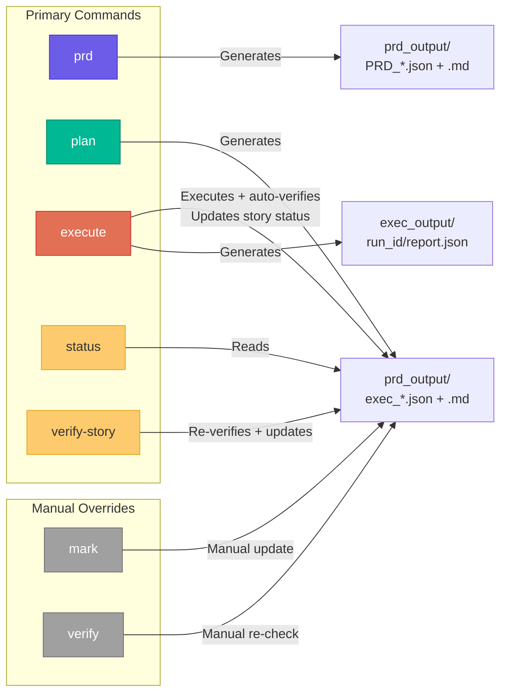
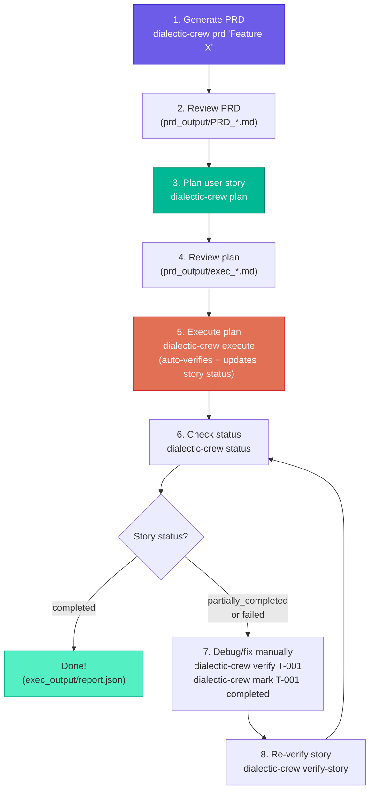

# CLI Reference

Dialectic Crew AI provides a command-line interface covering the full PRD lifecycle: generation, planning, execution with automatic verification, and status tracking.

**Entry points:**

```bash
uv run dialectic-crew <command> [arguments...]   # recommended (uses uv)
python main.py <command> [arguments...]           # alternative (direct Python)
```

> Throughout this document, examples show both forms. They are fully interchangeable — use whichever fits your setup.

---

## Command Overview



---

## Commands

### `prd` — Generate a PRD

Generates a Product Requirement Document using the full dialectic method with automatic retries until the quality score reaches 9.0.

```bash
uv run dialectic-crew prd "your feature request" [--files file1.pdf file2.png ...]
# or: python main.py prd "your feature request" [--files file1.pdf file2.png ...]
```

**Arguments:**

| Argument | Required | Description |
|----------|----------|-------------|
| `"feature request"` | Yes | The feature description |
| `--files` | No | One or more reference files (PDFs, images, text) for agents to analyze |

**Requirements:**
- `VISION.md` in the current directory
- API key configured in `.env`

**Output:** `prd_output/PRD_YYYYMMDD_HHMM.json` and `.md`

**Examples:**

```bash
uv run dialectic-crew prd "Login with two-factor authentication"
# or: python main.py prd "Login with two-factor authentication"

# Attach reference documents for agents to analyze
uv run dialectic-crew prd "Dashboard redesign" --files wireframe.png spec.pdf
```

**Compatibility shortcut:** Passing a string without a command is equivalent to `prd`:

```bash
python main.py "Login with 2FA"
# Same as: python main.py prd "Login with 2FA"
```

---

### `plan` — Plan User Story Execution

Plans the execution of a specific user story from a PRD. Uses the dialectic method to produce a `UserStoryExecutionPlan` with implementation tasks.

```bash
uv run dialectic-crew plan [prd.json] [US-001|index]
# or: python main.py plan [prd.json] [US-001|index]
```

**Arguments:**

| Argument | Required | Default | Description |
|----------|----------|---------|-------------|
| `prd.json` | No | Latest PRD in `prd_output/` | Path to the PRD JSON file |
| `US-001` | No | First user story | User story reference (ID or index) |

**Output:** `prd_output/exec_<US>_<timestamp>.json` and `.md`

**Examples:**

```bash
# Plan the first user story from the latest PRD
uv run dialectic-crew plan

# Plan a specific user story from a specific PRD
uv run dialectic-crew plan prd_output/PRD_20260308_1640.json US-002

# Use numeric index (0-based)
uv run dialectic-crew plan prd_output/PRD_20260308_1640.json 1
```

**User story references are flexible:**
- `US-001`, `US001`, `US1`, `1` all resolve to the same story

---

### `execute` — Execute the Plan

Executes the plan with CrewAI, running a full dialectic cycle per task. Each task goes through: Dialectic → Verify → Reimplement (if needed). After all tasks complete, a **post-execution verification phase** independently checks each completed task against PRD acceptance criteria and computes the user story status automatically.

```bash
uv run dialectic-crew execute [plan.json|--latest] [--spec-only]
# or: python main.py execute [plan.json|--latest] [--spec-only]
```

**Arguments:**

| Argument | Required | Default | Description |
|----------|----------|---------|-------------|
| `plan.json` | No | `--latest` | Path to the plan JSON or `--latest` |
| `--spec-only` | No | `false` | Generate only a Markdown spec (no LLM execution) |

**What happens during execution:**

1. The user story is marked `in_progress` in the plan JSON
2. Each task runs through the dialectic flow (implement → critique → synthesize → validate → verify → reimplement if needed)
3. Task statuses are updated in real-time (`in_progress` → `completed`/`failed`)
4. After all tasks finish, each completed task is independently verified against PRD acceptance criteria
5. Tasks that fail post-verification are downgraded to `failed`
6. The user story status is computed and persisted:
   - All tasks verified → `completed`
   - Some tasks verified → `partially_completed`
   - No tasks verified → `failed`

**Output:** `exec_output/<run_id>/report.json` and `spec_*.md`

**Examples:**

```bash
# Execute the latest plan with full dialectic + auto-verify
uv run dialectic-crew execute

# Execute a specific plan
uv run dialectic-crew execute prd_output/exec_US-001_20260308_1200.json

# Generate only a static spec (no LLM calls)
uv run dialectic-crew execute --spec-only
```

---

### `status` — View Story and Task Status

Displays the user story status and the completion status of all tasks in a plan.

```bash
uv run dialectic-crew status [plan.json|--latest]
# or: python main.py status [plan.json|--latest]
```

**Output example:**

```
=================================================================
  [/] US-001 — User Authentication
  Story status: partially_completed
  Score: 9.2/10.0  |  Plan: prd_output/exec_US-001_20260308_1750.json
=================================================================
  [x] T-001 — Set up auth module  (2026-03-08T18:30:00)  -- [post-verified] score: 8.5/10...
  [~] T-002 — Implement login endpoint
  [ ] T-003 — Add 2FA support  (deps: T-002)
  [!] T-004 — Write integration tests  -- [post-verify failed] score: 4.0/10...

  Progress: 1/4 completed, 1 failed, 1 in progress
=================================================================
```

**Status icons:**

| Icon | Status |
|------|--------|
| `[ ]` | Pending |
| `[~]` | In progress |
| `[x]` | Completed |
| `[/]` | Partially completed (story-level only) |
| `[!]` | Failed |

---

### `verify-story` — Verify All Tasks in a User Story

Verifies all completed tasks in the plan against PRD acceptance criteria using LLM agents and updates the user story status. This is useful for re-checking a story after manual changes or for debugging.

> **Note:** The `execute` command runs this automatically. Use `verify-story` only for manual re-checks.

```bash
uv run dialectic-crew verify-story [plan.json] [--prd prd.json]
# or: python main.py verify-story [plan.json] [--prd prd.json]
```

**Arguments:**

| Argument | Required | Default | Description |
|----------|----------|---------|-------------|
| `plan.json` | No | Latest plan | Path to the plan JSON |
| `--prd prd.json` | No | Latest PRD | PRD to load acceptance criteria from |

**What it does:**
1. Loads all completed tasks from the plan
2. For each completed task, runs an independent LLM verification against the task description and PRD acceptance criteria
3. Tasks that fail verification are downgraded to `failed`
4. Computes and persists the user story status: `completed`, `partially_completed`, or `failed`

**Examples:**

```bash
# Verify all tasks in the latest plan
uv run dialectic-crew verify-story

# Verify with a specific PRD
uv run dialectic-crew verify-story --prd prd_output/PRD_20260308_1640.json
```

---

## Manual Override Commands

The following commands are manual overrides. The `execute` command handles task verification and status tracking automatically; these are available for edge cases and debugging.

### `mark` — Manually Set Task Status

Manually overrides the status of a task in the plan. Useful when a human decides a task is done or needs to be reset.

```bash
uv run dialectic-crew mark <task_id> <status> [plan.json]
# or: python main.py mark <task_id> <status> [plan.json]
```

**Arguments:**

| Argument | Required | Description |
|----------|----------|-------------|
| `task_id` | Yes | Task ID (e.g., `T-001`) |
| `status` | Yes | `pending`, `in_progress`, `completed`, or `failed` |
| `plan.json` | No | Path to plan (default: latest) |

**Examples:**

```bash
uv run dialectic-crew mark T-001 completed
uv run dialectic-crew mark T-003 failed prd_output/exec_US-001_20260308_1750.json
```

---

### `verify` — Manually Re-verify a Single Task

Manually re-verifies a single task using an LLM agent. The `execute` command does this automatically for all tasks; use this for targeted re-checks.

```bash
uv run dialectic-crew verify <task_id> [plan.json] [--prd prd.json]
# or: python main.py verify <task_id> [plan.json] [--prd prd.json]
```

**Arguments:**

| Argument | Required | Description |
|----------|----------|-------------|
| `task_id` | Yes | Task ID to verify |
| `plan.json` | No | Path to plan (default: latest) |
| `--prd prd.json` | No | PRD to load acceptance criteria from |

**What it does:**
1. Loads the task description and acceptance criteria (from the PRD if provided)
2. Creates a Validator agent with file-reading tools
3. Agent reads project files to verify artifacts exist and are correct
4. Updates task status to `completed` or `failed` based on results

**Examples:**

```bash
# Re-verify a specific task
uv run dialectic-crew verify T-001

# Re-verify with PRD acceptance criteria
uv run dialectic-crew verify T-002 --prd prd_output/PRD_20260308_1640.json
```

---

### `help` — Show Help

```bash
uv run dialectic-crew help
# or: python main.py help
# or: python main.py -h / --help
```

---

## Typical Workflow


