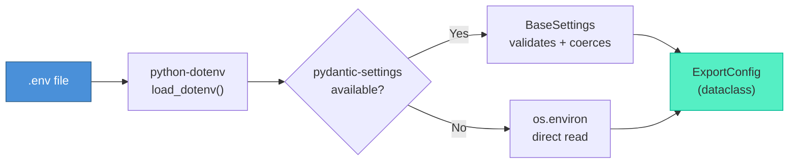
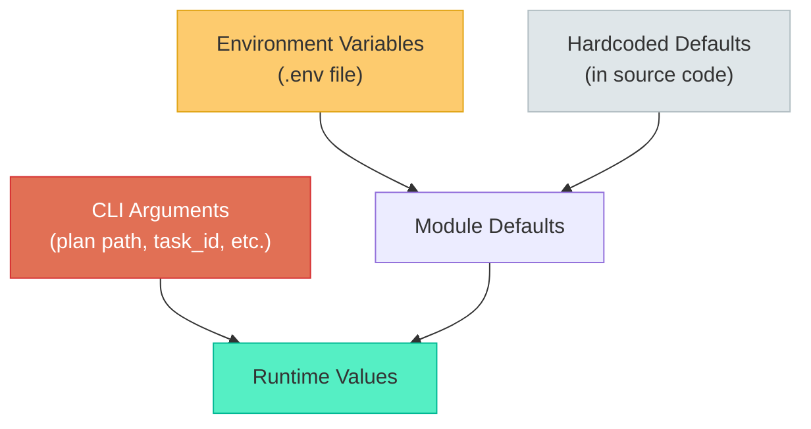
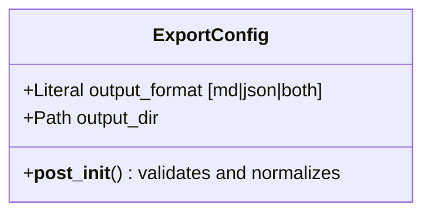
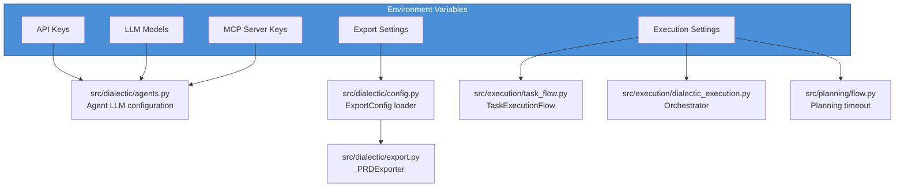

# Configuration

Dialectic Crew AI is configured through environment variables, loaded from a `.env` file via `python-dotenv` and optionally validated by `pydantic-settings`.

---

## Configuration Flow



The configuration system is resilient:
- If `pydantic-settings` is not installed, falls back to `os.environ`
- Invalid values fall back to safe defaults with logged warnings
- Empty strings are treated as absent

---

## Environment Variables

### API Keys

At least one API key must be set. The system checks for any of these:

| Variable | Description |
|----------|-------------|
| `OPENAI_API_KEY` | OpenAI API key |
| `ANTHROPIC_API_KEY` | Anthropic API key |
| `GROQ_API_KEY` | Groq API key |

### LLM Model Configuration

| Variable | Default | Description |
|----------|---------|-------------|
| `LLM_MODEL_SIMPLE` | `gpt-4o-mini` | Model for the Validator agent (Simple tier) |
| `LLM_MODEL_COMPLEX` | `gpt-4o` | Model for Critic, Synthesizer, Implementer (Complex tier) |
| `LLM_MODEL_REASONING` | `o3-mini` | Model for the Visionary Architect (Reasoning tier) |
| `LLM_MODEL_PLANNING` | same as Reasoning | Model for CrewAI's built-in crew planning step |
| `LLM_REQUEST_TIMEOUT` | `900` | Per-request LLM timeout in seconds |

### MCP Server Configuration

MCP (Model Context Protocol) servers provide agents with external tool capabilities. Each server is **conditionally loaded** — it is only instantiated when its required configuration is present. If a key or prerequisite is missing, the server is skipped with a warning log and agents operate without it.

| Variable | Required For | Description |
|----------|-------------|-------------|
| `CONTEXT7_API_KEY` | Context7 MCP server | API key for up-to-date library/framework documentation |
| `BRAVE_API_KEY` | Brave Search MCP server | API key for real-time web search |

The Sequential Thinking MCP server requires only Docker (no API key).

**Docker prerequisite:** The Brave Search and Sequential Thinking MCP servers run via Docker containers. If `docker` is not on your `PATH`, these servers are skipped automatically.

### Project Root

| Variable | Default | Description |
|----------|---------|-------------|
| `DIALECTIC_PROJECT_ROOT` | Auto-detected | Overrides automatic project root detection. Useful when running from a different working directory. |

### Vision Contexts

The app supports two vision documents, selected via the `--self` CLI flag:

| Context | Vision File | Flag | Purpose |
|---------|------------|------|---------|
| User project (default) | `knowledge/VISION.md` | *(none)* | Your project's product vision |
| Self-improvement | `internal/SELF_VISION.md` | `--self` | The app's own evolution vision |

The active vision context affects PRD generation, planning, execution, and the `vision_hash` embedded in exported files. See the [CLI Reference](cli.md) for per-command usage.

### Export Configuration

| Variable | Default | Valid Values | Description |
|----------|---------|-------------|-------------|
| `PRD_OUTPUT_FORMAT` | `json` | `md`, `json`, `both` | Export format for PRDs |
| `PRD_OUTPUT_DIR` | `prd_output` | Any path | Output directory for PRDs and plans |

### Execution Configuration

| Variable | Default | Description |
|----------|---------|-------------|
| `MAX_RETRIES_PER_TASK` | `3` | Maximum dialectic retries per task during execution |
| `MIN_QUALITY_SCORE` | `7.5` | Minimum score for a task to pass during execution |
| `CREW_KICKOFF_TIMEOUT` | `300` | Total timeout for a crew kickoff in seconds |

---

## Configuration Hierarchy



CLI arguments override environment variables, which override hardcoded defaults.

---

## Export Config Details

The `ExportConfig` dataclass (`src/dialectic/config.py`) manages export settings:



### Validation Rules

| Scenario | Behavior |
|----------|----------|
| `PRD_OUTPUT_FORMAT` absent or empty | Falls back to `"json"`, logs warning |
| `PRD_OUTPUT_FORMAT` invalid value | Falls back to `"json"`, logs warning |
| `PRD_OUTPUT_FORMAT` mixed case (e.g., `Both`) | Normalized to lowercase (`both`) |
| `PRD_OUTPUT_DIR` absent | Falls back to `Path("prd_output")` |
| `pydantic-settings` not installed | Falls back to `os.environ`, logs warning |
| `pydantic-settings` fails at runtime | Falls back to `os.environ`, logs warning |

---

## Example `.env` File

```env
# Required: at least one API key
OPENAI_API_KEY=sk-your-key-here

# Optional: LLM model overrides
LLM_MODEL_SIMPLE=gpt-4o-mini
LLM_MODEL_COMPLEX=gpt-4o
LLM_MODEL_REASONING=o3-mini
LLM_MODEL_PLANNING=o3
LLM_REQUEST_TIMEOUT=900

# Optional: export settings
PRD_OUTPUT_FORMAT=both
PRD_OUTPUT_DIR=prd_output

# Optional: execution settings
MAX_RETRIES_PER_TASK=3
MIN_QUALITY_SCORE=7.5
CREW_KICKOFF_TIMEOUT=300

# Optional: MCP server API keys (agents work without these)
CONTEXT7_API_KEY=ctx7sk-...
BRAVE_API_KEY=...
```

---

## Where Configuration Is Used


