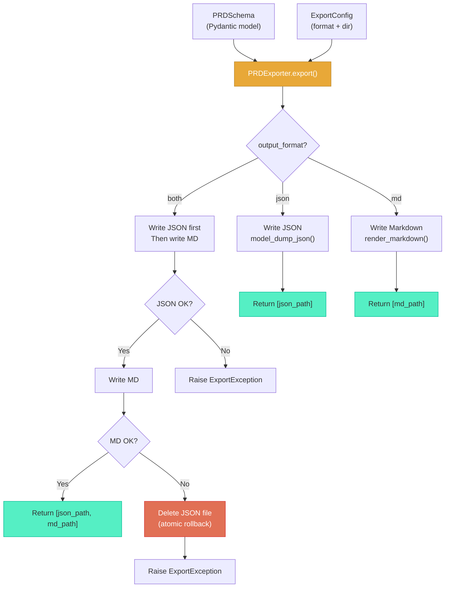
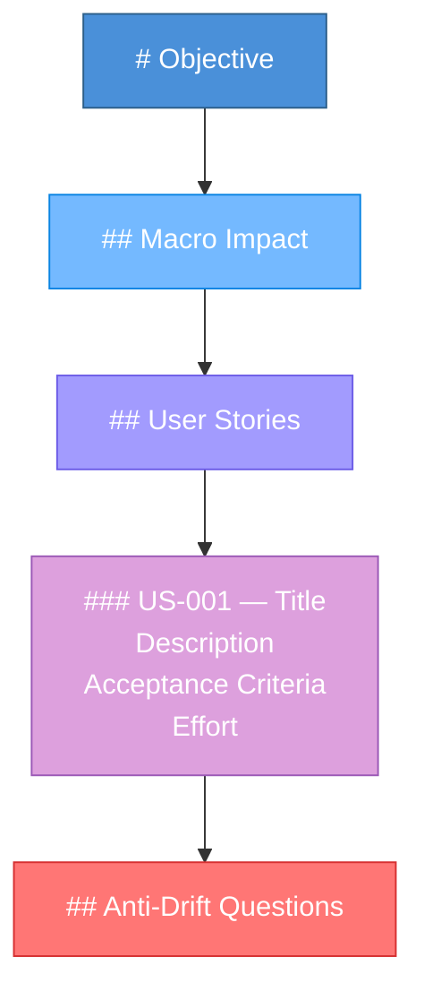
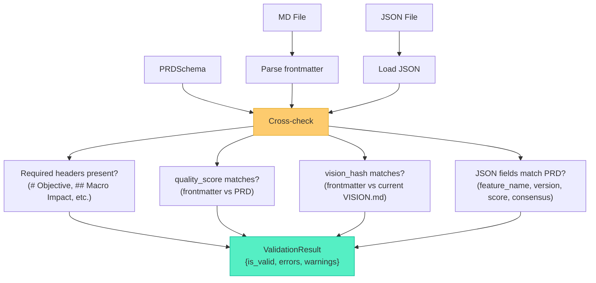

# Export System

The export system handles converting Pydantic models into persistent files (JSON and Markdown). It includes consistency validation and atomic rollback guarantees.

**Source:** `src/dialectic/export.py`

---

## Export Architecture



---

## PRDExporter

The `PRDExporter` class handles dual export with rollback semantics.

### Export Behavior

| Format | What Happens |
|--------|-------------|
| `json` | Writes `<slug>-<version>.json` via `model_dump_json()` |
| `md` | Writes `<slug>-<version>.md` via `render_markdown()` |
| `both` | Writes JSON first, then MD. If MD fails, JSON is **rolled back** (deleted) |

### File Naming

Files are named using a slugified version of the feature name and version:

```
<slug>-<version>.json
<slug>-<version>.md
```

For example: `login-with-2fa-1.0.json`

The slugification converts to lowercase, replaces non-alphanumeric characters with hyphens, and collapses multiple hyphens.

---

## Markdown Rendering

### Structure

The rendered Markdown has two parts: **YAML frontmatter** and **body sections**.

#### Frontmatter

```yaml
---
quality_score: 9.2
validation_status: approved
generated_at: 2026-03-08T18:30:00Z
vision_hash: a1b2c3d4...
---
```

| Field | Source | Description |
|-------|--------|-------------|
| `quality_score` | `PRDSchema.quality_score` | The validation score |
| `validation_status` | Derived from `consensus_reached` | `"approved"` or `"unapproved"` |
| `generated_at` | Current UTC time | ISO 8601 timestamp |
| `vision_hash` | SHA-256 of `VISION.md` | Enables drift detection |

The `vision_hash` is only included if `VISION.md` can be read. If the file is unavailable, the field is omitted silently.

#### Body Sections



---

## Standalone Markdown Converters

Two additional functions produce Markdown without frontmatter:

### `prd_to_markdown(prd)`

Converts a `PRDSchema` to a narrative Markdown document (used as fallback in `DialecticFlow`).

Sections: Title → Score → Objective → Macro Impact → User Stories → Anti-Drift Questions → Final Validation

### `execution_plan_to_markdown(plan)`

Converts a `UserStoryExecutionPlan` to Markdown.

Sections: Title → Score → Approach → Tasks (sorted by order) → Mitigated Risks → Technical Notes → Validation

---

## Consistency Validation

The `validate_consistency()` function cross-checks the generated Markdown against the JSON and in-memory PRD.



### Checks Performed

| Check | Severity | Description |
|-------|----------|-------------|
| Required headers in MD | Error | `# Objective`, `## Macro Impact`, `## User Stories`, `## Anti-Drift Questions` |
| `quality_score` match | Error | Frontmatter score must match PRD score |
| `vision_hash` match | Error | Frontmatter hash must match current `VISION.md` SHA-256 |
| `feature_name` match | Error | JSON field must match PRD |
| `version` match | Error | JSON field must match PRD |
| `consensus_reached` match | Error | JSON field must match PRD |
| Missing `quality_score` in frontmatter | Warning | Acceptable but noted |
| Missing `vision_hash` in frontmatter | Warning | Acceptable but noted |
| Cannot read `VISION.md` | Warning | Hash check skipped |

### Frontmatter Parsing

The system prefers PyYAML for robust parsing. If PyYAML is not available, it falls back to a simple line-by-line `key: value` parser. A debug log is emitted when the fallback is used.

---

## Output Directory Structure

```
prd_output/
├── PRD_20260308_1640.json          # PRD (via fallback save)
├── PRD_20260308_1640.md            # PRD Markdown (via fallback)
├── login-with-2fa-1.0.json        # PRD (via PRDExporter)
├── login-with-2fa-1.0.md          # PRD Markdown (via PRDExporter)
├── exec_US-001_20260308_1750.json  # Execution plan
└── exec_US-001_20260308_1750.md    # Plan Markdown

exec_output/
└── 20260308_1800/
    ├── report.json                 # ExecutionReport
    ├── spec_US-001_20260308_1800.md  # Implementation spec
    └── T-001_output/               # Per-task output directory
```

---

## Error Handling

| Scenario | Behavior |
|----------|----------|
| JSON serialization fails | `ExportException` raised, no files created |
| JSON write fails | `ExportException` raised, no files created |
| MD rendering fails (format=`both`) | JSON rolled back, `ExportException` raised |
| MD write fails (format=`both`) | JSON rolled back, `ExportException` raised |
| JSON rollback itself fails | Logged, original exception still raised |
| Unknown format value | `ExportException` raised |
