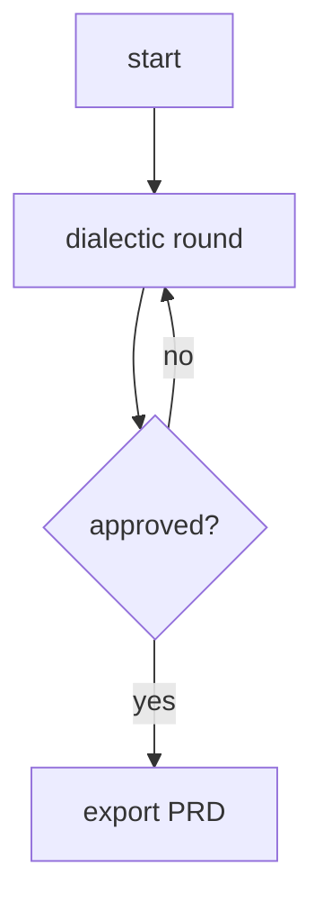
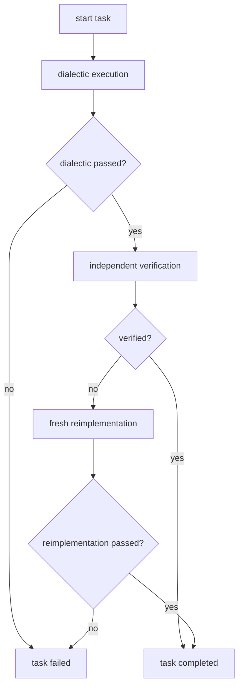
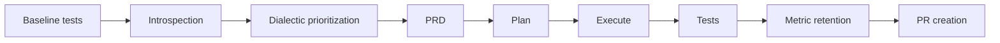
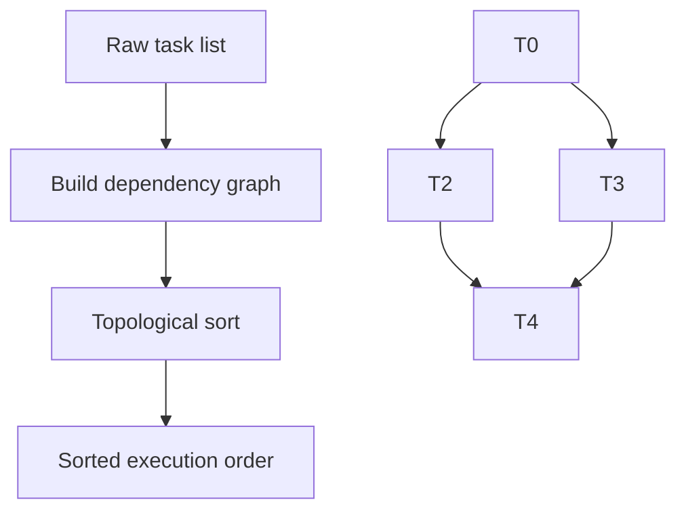
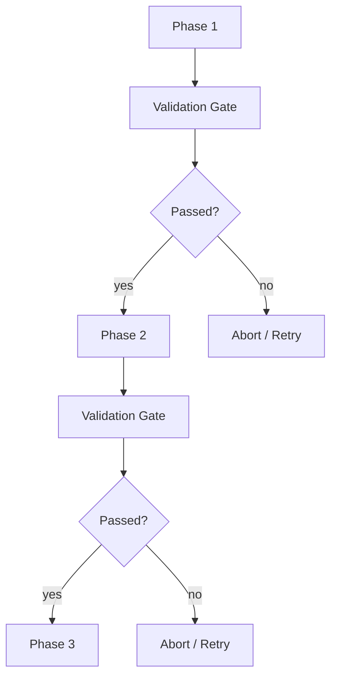
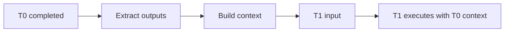
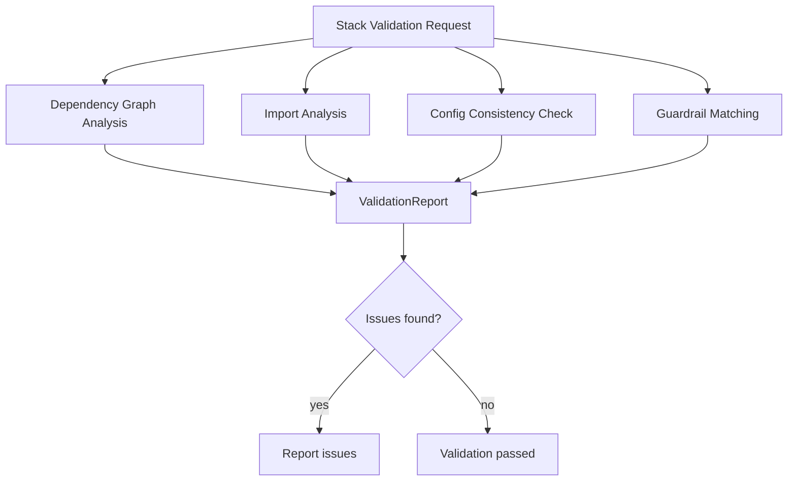

# Flows

Dialectic Crew AI uses CrewAI flows for PRD generation and per-task execution, plus orchestrator-style modules for planning, execution coordination, and self-improvement.

## Flow inventory

| Component | Type | Source |
|---|---|---|
| PRD generation | CrewAI Flow | `src/dialectic/prd_flow.py` |
| User-story planning | orchestrated crew loop | `src/planning/flow.py` |
| Task execution | CrewAI Flow | `src/execution/task_flow.py` |
| Execution coordinator | orchestrator | `src/execution/dialectic_execution.py` |
| Self-improvement | orchestrator | `src/main/self_improve.py` |

## 1. PRD generation flow

**Source:** `src/dialectic/prd_flow.py`



Current behavior:

- builds a dialectic crew through `src/dialectic/prd_runtime.py` using YAML-backed task templates from `src/dialectic/config/tasks_prd.yaml`
- uses planning and memory inside the crew
- validates outputs with Pydantic guardrails
- emits metrics and hook summaries
- exports JSON and/or Markdown artifacts
- persists flow state through CrewAI `@persist()` using `.dialectic/flows.db` by default
- stores an explicit `current_phase` in flow state so resume can jump to the correct next step

## 2. User-story planning

**Source:** `src/planning/flow.py`

Planning is not implemented as a CrewAI `Flow` subclass, but it still runs a dialectic crew with retry logic.

Current behavior:

- loads a PRD and resolves one user story
- builds the planning crew through `src/planning/runtime.py` using YAML-backed agent/task templates from `src/planning/config/agents.yaml` and `src/planning/config/tasks.yaml`
- retries until the plan reaches `MIN_PLAN_SCORE` (default `7.5`) or exhausts retries
- exports `UserStoryExecutionPlan` artifacts to `prd_output/`
- uses the active vision context, including `VisionContext.SELF` when requested

Planning intentionally remains artifact-based in this phase instead of becoming a CrewAI `Flow` subclass. Persistence and resume work are concentrated in PRD generation and per-task execution.

## 3. Task execution flow

**Source:** `src/execution/task_flow.py`



Key details:

- the main dialectic crew is built through `src/execution/runtime.py` using YAML-backed task templates from `src/execution/config/tasks_dialectic.yaml`
- the independent verifier now builds its task through `src/execution/task_verify_runtime.py` using `src/execution/config/tasks_taskflow_verify.yaml`
- the independent reimplementer now builds its tasks through `src/execution/task_reimplement_runtime.py` using `src/execution/config/tasks_taskflow_reimplement.yaml`
- the verifier reads actual files, not just prior agent output
- the reimplementer is intentionally fresh and context-light
- task-level metrics are emitted passively
- hook scopes can enforce budgets and protected paths
- task flow state is persisted via CrewAI `@persist()` and resumes through its explicit phase machine

## 4. Execution coordinator

**Source:** `src/execution/dialectic_execution.py`

This module coordinates the whole plan run.

Responsibilities:

- sorts tasks topologically when dependencies exist
- feeds context from completed tasks into later tasks
- persists task status changes into the plan artifact
- post-verifies completed tasks against PRD acceptance criteria via `src/execution/verify.py`, whose standalone verification crew now comes from `src/execution/verify_runtime.py` and `src/execution/config/tasks_verify.yaml`
- computes story status (`completed`, `partially_completed`, `failed`)
- writes an execution report into `exec_output/`
- writes `checkpoint.json` snapshots so interrupted runs can resume without redoing completed tasks

## 5. Self-improvement orchestrator

**Source:** `src/main/self_improve.py`



Current behavior worth documenting, because code now enforces it:

- baseline tests must already pass
- `git` must exist
- worktree must be clean before branch creation
- improvement-opportunity debate is built through `src/dialectic/prioritize_runtime.py` using YAML-backed prioritize agent/task templates, while graceful degradation remains explicit in `src/dialectic/prioritize.py`
- exact PRD, plan, and execution artifact paths are carried between stages
- PRD flow IDs and task flow IDs are stored in `.dialectic/self_improve/<cycle-id>.json`
- `dialectic-crew self-improve --resume <cycle-id>` reloads that snapshot and resumes from the next unfinished stage
- resume prints the last failure reason, the next stage to run, and the artifacts/checkpoints being reused
- stage-specific resume skips already completed PRD/planning work and only reruns downstream stages that were unfinished or failed
- validation prefers `uv run pytest` and falls back to `python -m pytest`
- self-improve validation uses `SELF_IMPROVE_TEST_TIMEOUT` (default `1800`) because the full suite may include slow LLM tests
- failing pytest snapshots print captured stdout/stderr tails before the cycle aborts
- PR creation is optional when `gh` is unavailable

## Vision context across flows

Most flows operate against one of two contexts:

- `VisionContext.PROJECT` → `knowledge/VISION.md`
- `VisionContext.SELF` → `internal/SELF_VISION.md`

That context is passed through state or function arguments and becomes a CrewAI knowledge source via `vision_knowledge(context)`.

## Declarative crew assets

Stable crew/task text now lives in package-local YAML files, while orchestration stays in Python:

- `src/dialectic/config/agents.yaml`
- `src/dialectic/config/tasks_prd.yaml`
- `src/dialectic/config/agents_prioritize.yaml`
- `src/dialectic/config/tasks_prioritize.yaml`
- `src/planning/config/agents.yaml`
- `src/planning/config/tasks.yaml`
- `src/execution/config/tasks_dialectic.yaml`
- `src/execution/config/tasks_verify.yaml`

Thin runtime builder modules bind those templates to live agents, schemas, guardrails, memory scopes, and knowledge sources at kickoff time.

## Metrics and hooks across flows

The flows are instrumented rather than silent:

- `metrics.py` captures passive PRD/task/guardrail events
- `hooks.py` tracks tokens, estimated cost, and protected-path writes
- `self-improve` uses hook scopes to keep its own blast radius in check

## Additional execution components

### Topological sorting

**Source:** `src/execution/topological_sort.py`

Tasks with dependencies are sorted to ensure correct execution order:



### Validation gates

**Source:** `src/execution/validation_gate.py`

Validation gates enforce checkpoints before proceeding to the next phase:



### Checkpoint system

**Source:** `src/execution/checkpoint.py`

Interrupted runs can be resumed without redoing completed tasks:

- Checkpoints stored in `exec_output/<run_id>/checkpoint.json`
- Contains task status, execution state, and artifact references
- Resume via `execute --resume-run <run-id>`

### Context building for dependent tasks

**Source:** `src/execution/context_builder.py`

When tasks have dependencies, completed task outputs are fed into dependent tasks:



## Stack validation

**Source:** `src/dialectic/stack_validation.py`

Stack-aware validation checks project consistency:



## Logging system

**Source:** `src/dialectic/app_logging.py` and `src/dialectic/crewai_event_logger.py`

Centralized logging with multiple output sinks:

```mermaid
flowchart LR
    subgraph Input
        A[Application logs]
        B[CrewAI events]
        C[Errors]
    end
    
    subgraph Processing
        D[RotatingFileHandler]
        E[JSON Formatter]
        F[Error Filter]
    end
    
    subgraph Output
        G[.dialectic/app.log]
        H[.dialectic/app.jsonl]
        I[.dialectic/error.log]
        J[stderr (optional)]
    end
    
    A --> D
    B --> E
    C --> F
    
    D --> G
    D --> J
    E --> H
    F --> I
    F --> J
```

Features:
- Rotating log files with size limits
- JSON-structured logging for machine parsing
- Separate error log
- Optional stderr output
- CrewAI event capture for debugging agent behavior