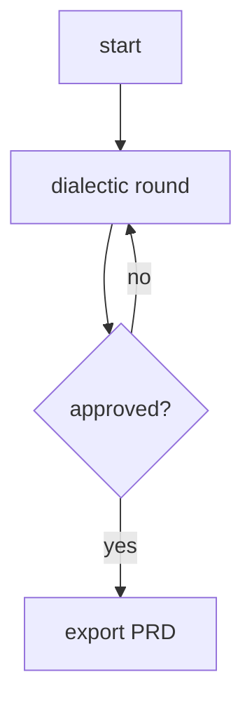
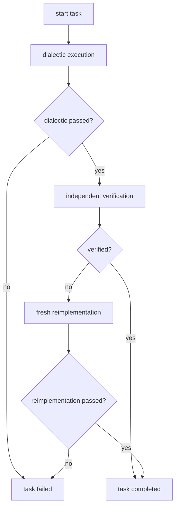
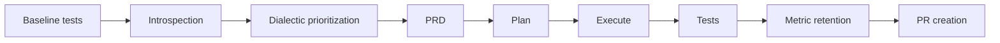

# Flows

Dialectic Crew AI uses CrewAI flows for PRD generation and per-task execution, plus orchestrator-style modules for planning, execution coordination, and self-improvement.

## Flow inventory

| Component | Type | Source |
|---|---|---|
| PRD generation | CrewAI Flow | `src/dialectic/prd_flow.py` |
| User-story planning | orchestrated crew loop | `src/planning/flow.py` |
| Task execution | CrewAI Flow | `src/execution/task_flow.py` |
| Execution coordinator | orchestrator | `src/execution/dialectic_execution.py` |
| Self-improvement | orchestrator | `src/main/self_improve.py` |

## 1. PRD generation flow

**Source:** `src/dialectic/prd_flow.py`

Current behavior:

- builds a dialectic crew with `vision_knowledge(context)`
- uses planning and memory inside the crew
- validates outputs with Pydantic guardrails
- emits metrics and hook summaries
- exports JSON and/or Markdown artifacts

## 2. User-story planning

**Source:** `src/planning/flow.py`

Planning is not implemented as a CrewAI `Flow` subclass, but it still runs a dialectic crew with retry logic.

Current behavior:

- loads a PRD and resolves one user story
- retries until the plan reaches `MIN_PLAN_SCORE` (default `7.5`) or exhausts retries
- exports `UserStoryExecutionPlan` artifacts to `prd_output/`
- uses the active vision context, including `VisionContext.SELF` when requested

## 3. Task execution flow

**Source:** `src/execution/task_flow.py`

Key details:

- the verifier reads actual files, not just prior agent output
- the reimplementer is intentionally fresh and context-light
- task-level metrics are emitted passively
- hook scopes can enforce budgets and protected paths

## 4. Execution coordinator

**Source:** `src/execution/dialectic_execution.py`

This module coordinates the whole plan run.

Responsibilities:

- sorts tasks topologically when dependencies exist
- feeds context from completed tasks into later tasks
- persists task status changes into the plan artifact
- post-verifies completed tasks against PRD acceptance criteria
- computes story status (`completed`, `partially_completed`, `failed`)
- writes an execution report into `exec_output/`

## 5. Self-improvement orchestrator

**Source:** `src/main/self_improve.py`

Current behavior worth documenting, because code now enforces it:

- baseline tests must already pass
- `git` must exist
- worktree must be clean before branch creation
- exact PRD, plan, and execution artifact paths are carried between stages
- validation prefers `uv run pytest` and falls back to `python -m pytest`
- PR creation is optional when `gh` is unavailable

## Vision context across flows

Most flows operate against one of two contexts:

- `VisionContext.PROJECT` → `knowledge/VISION.md`
- `VisionContext.SELF` → `internal/SELF_VISION.md`

That context is passed through state or function arguments and becomes a CrewAI knowledge source via `vision_knowledge(context)`.

## Metrics and hooks across flows

The flows are instrumented rather than silent:

- `metrics.py` captures passive PRD/task/guardrail events
- `hooks.py` tracks tokens, estimated cost, and protected-path writes
- `self-improve` uses hook scopes to keep its own blast radius in check