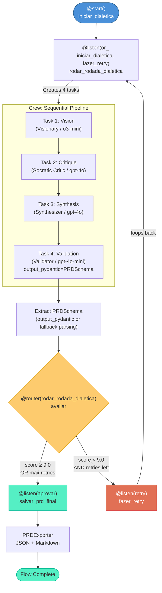
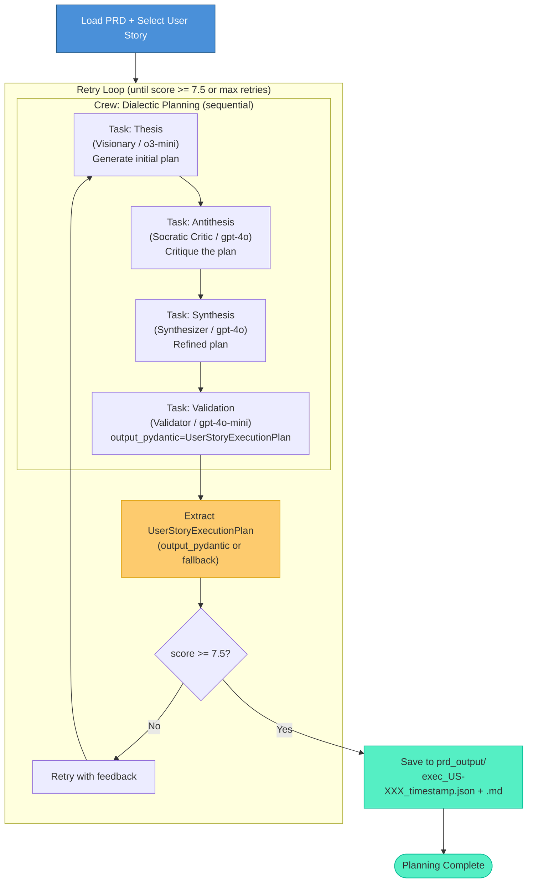
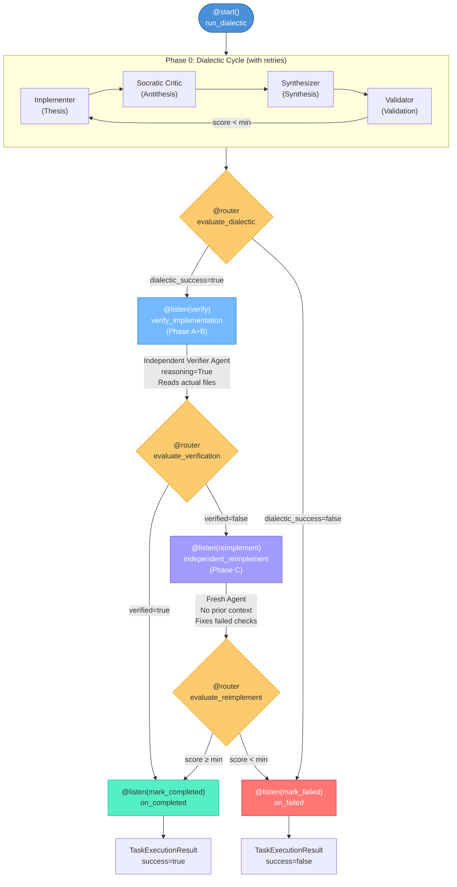
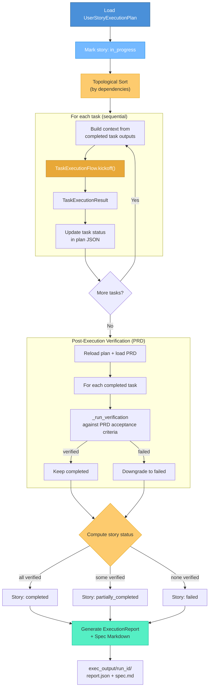

# Flows

Dialectic Crew AI uses the [CrewAI Flow API](https://docs.crewai.com/en/concepts/flows) to orchestrate multi-step AI workflows. There are three main flows, each applying the dialectic method at a different level of granularity.

> **Interactive Flow Visualizations**: Auto-generated HTML plots are available in the [`docs/plots/`](plots/) directory. Open them in a browser for interactive node-by-node exploration.
>
> To regenerate them:
> ```python
> from dialectic.prd_flow import DialecticFlow
> DialecticFlow().plot("prd_flow_plot")
>
> from execution.task_flow import TaskExecutionFlow
> TaskExecutionFlow().plot("task_execution_flow_plot")
> ```

---

## 1. PRD Generation Flow (`DialecticFlow`)

**Source:** `src/dialectic/prd_flow.py`
**State:** `DialecticState` (`src/dialectic/state.py`)
**Persistence:** `SQLiteFlowPersistence` (automatic state recovery)
**Output:** `PRDSchema` → exported to `prd_output/PRD_*.json` + `.md`

This is the main flow. It takes a feature request (and optional file attachments) and produces a complete, validated PRD through iterative dialectic cycles.

### Flow Diagram



### Key Features

- **Retry loop**: Uses `@router` to conditionally route to "aprovar" (approve) or "retry" based on quality score
- **Guardrail**: `_prd_guardrail` validates that the output is a valid `PRDSchema` with at least 1 user story
- **Fallback parsing**: If `output_pydantic` fails, regex-based JSON extraction from raw text is attempted
- **Configurable**: Max retries via `DialecticState.max_retries` (default: 5)
- **Persistence**: Lazy-initialized SQLite-backed state persistence enables recovery after interruptions
- **Knowledge**: Crews are configured with `knowledge_sources=[vision_knowledge()]` for semantic access to `knowledge/VISION.md`
- **Planning**: Crews run with `planning=True` using the Planning LLM tier for coordination
- **Memory**: Crews run with `memory=True` so agents learn from earlier interactions
- **Garbage prevention**: Invalid PRDs (parse failures) are never saved; a diagnostic is added to `final_validation_notes` for retry feedback
- **File attachments**: Optional reference files (PDFs, images, text) can be attached via `--files` and are passed to the crew as `input_files` (requires `crewai_files`)

### State Fields

| Field | Type | Description |
|-------|------|-------------|
| `feature_objective` | `str` | The feature request from the user |
| `prd_data` | `dict` | Serialized PRD data |
| `quality_score` | `float` | Current quality score (0-10) |
| `retry_count` | `int` | Number of retries so far |
| `max_retries` | `int` | Maximum retries allowed (default: 5) |
| `consensus_reached` | `bool` | Whether consensus was reached |
| `final_validation_notes` | `str` | Validator's notes |
| `file_paths` | `list[str]` | Paths to attached reference files (optional) |

---

## 2. User Story Planning Flow

**Source:** `src/planning/flow.py`
**Output:** `UserStoryExecutionPlan` → exported to `prd_output/exec_*.json` + `.md`

Takes a PRD and a specific user story, then produces an implementation plan through the same dialectic method. This uses a synchronous crew kickoff with a retry loop and quality gate.

### Flow Diagram



### Key Features

- **Retry loop**: Synchronous `crew.kickoff()` with quality gate — retries until score >= 7.5 or max retries reached
- **Knowledge**: Crews are configured with `knowledge_sources=[vision_knowledge()]` for semantic access to `knowledge/VISION.md`
- **Guardrail**: `_plan_guardrail` ensures at least 1 implementation task in the plan
- **Auto-discovery**: Finds the latest PRD if no path specified; resolves user story by ID or index
- **Normalization**: Handles `US-001`, `US001`, `US1`, and plain index references
- **Planning**: Crews run with `planning=True` using the Planning LLM tier for coordination
- **Memory**: Crews run with `memory=True` so agents retain context within the planning session

---

## 3. Task Execution Flow (`TaskExecutionFlow`)

**Source:** `src/execution/task_flow.py`
**State:** `TaskFlowState`
**Persistence:** `SQLiteFlowPersistence` (automatic state recovery)
**Output:** `TaskExecutionResult`

The most sophisticated flow — a three-phase pipeline per task with conditional routing. If the dialectic cycle passes, the result is independently verified. If verification fails, a fresh agent re-implements the missing parts.

### Flow Diagram



### Phase Descriptions

| Phase | Name | Purpose |
|-------|------|---------|
| 0 | **Dialectic** | Full implement → critique → synthesize → validate cycle with retries |
| A+B | **Verify** | Independent agent with `reasoning=True` reads actual files to verify artifacts exist and acceptance criteria are met |
| C | **Reimplement** | Fresh agent (no dialectic context) fixes only the specific failed checks |

### Key Features

- **Three conditional routers**: Each phase evaluation uses `@router` for branching
- **Independent verification**: The verifier agent has no access to the dialectic context — it reads actual project files
- **Fresh reimplementation**: Phase C uses a new agent with no prior context, only the failed checks
- **Reasoning mode**: Verification and reimplementation agents use `reasoning=True` with `max_reasoning_attempts=2`
- **Knowledge**: Crews are configured with `knowledge_sources=[vision_knowledge()]` for semantic vision access
- **Planning and memory**: Dialectic crews run with `planning=True` and `memory=True` for better coordination
- **Persistence**: Lazy-initialized SQLite-backed state persistence via `SQLiteFlowPersistence`

### State Fields (`TaskFlowState`)

| Field | Type | Description |
|-------|------|-------------|
| `task_id` | `str` | Task identifier (e.g., T-001) |
| `task_title` | `str` | Task title |
| `task_description` | `str` | Full task description |
| `context_str` | `str` | Context from previously completed tasks |
| `acceptance_checks` | `list[str]` | Verifiable criteria |
| `min_score` | `float` | Minimum score for approval (default: 7.5) |
| `max_retries` | `int` | Max dialectic retries (default: 3) |
| `dialectic_score` | `float` | Score from dialectic phase |
| `dialectic_success` | `bool` | Whether dialectic passed |
| `verified` | `bool` | Whether verification passed |
| `verification` | `VerificationResult` | Detailed verification results |
| `reimplement_success` | `bool` | Whether reimplementation passed |
| `phases_executed` | `list[str]` | List of phases that ran |

---

## 4. Execution Orchestrator

**Source:** `src/execution/dialectic_execution.py`

Not a CrewAI Flow itself, but the coordinator that runs `TaskExecutionFlow` for each task in the plan. After all tasks complete, a **post-execution verification phase** independently checks each completed task against PRD acceptance criteria and computes user story-level status.

### Orchestration Diagram



### Key Features

- **Dependency awareness**: Tasks are topologically sorted; if cycles are detected, falls back to `order` field
- **Context accumulation**: Each task receives output summaries from all previously completed tasks
- **Live status tracking**: Task statuses (`pending` → `in_progress` → `completed`/`failed`) are written back to the plan JSON in real-time
- **Post-execution verification**: After all tasks finish, each completed task is independently verified against PRD acceptance criteria using `_run_verification()`. Tasks that fail are downgraded to `failed`
- **User story status**: The orchestrator computes and persists a story-level status (`completed`, `partially_completed`, or `failed`) based on post-verification results
- **Final report**: Generates `ExecutionReport` with per-task results, verification lists, and overall success status

---

## Flow Comparison

| Feature | PRD Flow | Planning Flow | Task Execution Flow | Execution Orchestrator |
|---------|----------|---------------|---------------------|------------------------|
| CrewAI Flow class | Yes (`DialecticFlow`) | No (single Crew) | Yes (`TaskExecutionFlow`) | No (coordinator) |
| Retry mechanism | `@router` loop | Quality gate loop | Loop in `run_dialectic()` | N/A |
| Verification | Score-based only | Score-based only | Independent agent + file reading | Post-execution PRD verification |
| Reimplementation | Via retry | N/A | Fresh agent (Phase C) | N/A |
| Status tracking | N/A | N/A | Internal (flow state) | Task + user story status persisted to plan JSON |
| Output type | `PRDSchema` | `UserStoryExecutionPlan` | `TaskExecutionResult` | `ExecutionReport` |
| Score threshold | 9.0 | 9.0 (in validation) | Configurable (default: 7.5) | 7.0 (post-verification) |
| Guardrails | `_prd_guardrail` | `_plan_guardrail` | `_quality_guardrail`, `_verification_guardrail` | N/A |
