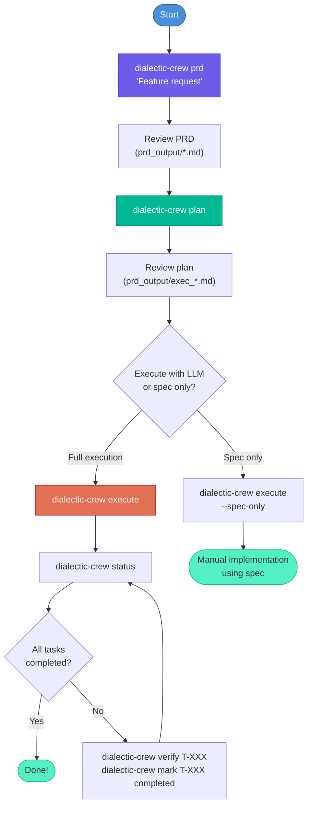

# Getting Started

This guide covers installation, prerequisites, and running your first dialectic PRD generation.

---

## Prerequisites

- **Python 3.10–3.13**
- **An LLM API key** (OpenAI, Anthropic, or Groq)
- **`knowledge/VISION.md`** — your project's vision document (a template is provided; customize it for your project)
- **Docker** (optional) — required for Brave Search and Sequential Thinking MCP servers

---

## Installation

### Option 1: Using uv (recommended)

```bash
git clone <repo-url>
cd dialectic-crew-ai
uv sync
source .venv/bin/activate
```

### Option 2: Using pip

```bash
git clone <repo-url>
cd dialectic-crew-ai
pip install -e .
```

### Option 3: Using pip with virtual environment

```bash
git clone <repo-url>
cd dialectic-crew-ai
python -m venv .venv
source .venv/bin/activate
pip install -e .
```

---

## Configuration

1. Copy the example environment file:

```bash
cp .env.example .env
```

2. Edit `.env` and add your API key:

```env
OPENAI_API_KEY=sk-your-key-here
```

3. (Optional) Customize other settings:

```env
# Use different models
LLM_MODEL_SIMPLE=gpt-4o-mini
LLM_MODEL_COMPLEX=gpt-4o
LLM_MODEL_REASONING=o3-mini
LLM_MODEL_PLANNING=o3

# Export format: json, md, or both
PRD_OUTPUT_FORMAT=both

# MCP server keys (optional — agents work without these)
CONTEXT7_API_KEY=ctx7sk-...
BRAVE_API_KEY=...
```

See [Configuration](configuration.md) for all available options.

---

## Your First PRD

### Step 1: Generate a PRD

```bash
uv run dialectic-crew prd "User authentication with two-factor authentication"
# or: python main.py prd "User authentication with two-factor authentication"
```

You can also attach reference files (PDFs, images, text documents) for agents to analyze:

```bash
uv run dialectic-crew prd "Dashboard redesign" --files wireframe.png spec.pdf
```

The system will:
1. Load `knowledge/VISION.md` as a semantic knowledge source (via `TextFileKnowledgeSource`)
2. Run the Visionary agent to propose an initial solution (thesis)
3. Run the Socratic Critic to challenge it (antithesis)
4. Run the Synthesizer to merge them (synthesis)
5. Run the Validator to score it (validation)
6. Repeat until the quality score reaches 9.0 (or max retries)

The agents consult `knowledge/VISION.md` to ensure alignment with your project's vision.

**Output:** `prd_output/PRD_YYYYMMDD_HHMM.json` and `.md`

### Step 2: Review the PRD

Open the generated Markdown file to review the PRD:

```bash
cat prd_output/PRD_*.md
```

The PRD includes:
- Feature name and objective
- Macro impact assessment
- User stories with acceptance criteria
- Anti-drift questions ensuring vision alignment
- Quality score and validation notes

### Step 3: Plan a User Story

Select a user story from the PRD and generate an implementation plan:

```bash
uv run dialectic-crew plan
# or: python main.py plan
```

This will:
1. Load the latest PRD
2. Select the first user story
3. Run a dialectic cycle to produce an implementation plan

**Output:** `prd_output/exec_US-001_YYYYMMDD_HHMM.json` and `.md`

### Step 4: Execute the Plan

Run the plan with full dialectic execution per task:

```bash
uv run dialectic-crew execute
# or: python main.py execute
```

Each task goes through:
1. **Dialectic cycle**: Implement → Critique → Synthesize → Validate (with retries)
2. **Verification**: Independent agent reads files to verify artifacts
3. **Reimplementation**: If verification fails, a fresh agent fixes the gaps

**Output:** `exec_output/<run_id>/report.json`

### Step 5: Check Status

```bash
uv run dialectic-crew status
# or: python main.py status
```

---

## End-to-End Workflow



---

## Convenience Scripts

For quick testing, the repository includes convenience scripts:

| Script | Equivalent | Description |
|--------|-----------|-------------|
| `python run_dialectic.py` | `uv run dialectic-crew prd "..."` | Full dialectic with hardcoded feature |
| `python run_simple.py` | `uv run dialectic-crew prd "..."` (single pass) | Single pass, no retry |
| `python run_user_story_dialectic.py` | `uv run dialectic-crew plan` | Plans a user story |

---

## Output Files

After running the full workflow, you'll have:

```
prd_output/
├── PRD_20260308_1640.json          # Structured PRD (machine-readable)
├── PRD_20260308_1640.md            # Narrative PRD (human-readable)
├── exec_US-001_20260308_1750.json  # Implementation plan
└── exec_US-001_20260308_1750.md    # Plan in Markdown

exec_output/
└── 20260308_1800/
    ├── report.json                 # Execution report with per-task results
    └── spec_US-001_20260308_1800.md  # Implementation spec
```

---

## Troubleshooting

### "knowledge/VISION.md not found"

Make sure you're running from the project root directory where `knowledge/VISION.md` exists. This file is your project's vision template — customize it for your project. It must be inside the `knowledge/` directory (CrewAI convention for file-based knowledge sources).

For self-improvement mode (`--self`), the system looks for `internal/SELF_VISION.md` instead. Make sure this file exists if you're using the `--self` flag.

### "Configure your API key first!"

Add at least one API key to your `.env` file. See [Configuration](configuration.md).

### Timeout errors

Increase the timeout values in `.env`:

```env
LLM_REQUEST_TIMEOUT=1800
CREW_KICKOFF_TIMEOUT=600
```

### Low quality scores

The system retries up to `MAX_RETRIES` (default: 5) times. If scores consistently stay below 9.0:
- Review `knowledge/VISION.md` — agents use it as their primary reference via semantic retrieval
- Try a stronger reasoning model: `LLM_MODEL_REASONING=o3`
- Check that your feature request is clear and specific

---

## Self-Improvement Mode

The app can use its own dialectic pipeline to evolve itself. Use the `--self` flag to run against `internal/SELF_VISION.md` instead of `knowledge/VISION.md`:

```bash
# Generate a PRD for the app's own improvement
uv run dialectic-crew prd "Add memory support for cross-session learning" --self

# Plan the implementation
uv run dialectic-crew plan --self

# Execute the plan
uv run dialectic-crew execute --self
```

In self-improvement mode, agents consult `internal/SELF_VISION.md` which contains the app's own evolution roadmap and design principles.

### Automated Self-Improvement

For a fully automated improvement cycle, use the `self-improve` command:

```bash
# See what improvements the introspection engine finds (no changes made)
uv run dialectic-crew self-improve --dry-run

# Run one improvement cycle: introspect → PRD → plan → execute → validate → PR
uv run dialectic-crew self-improve

# Run up to 3 improvements per cycle
uv run dialectic-crew self-improve --max 3
```

The self-improve command:
1. Inspects `internal/SELF_VISION.md` for unchecked roadmap items
2. Checks metric trends (PRD scores, retries, guardrail rejections)
3. Scans for code health issues (TODOs, test coverage)
4. Analyses recurring failure patterns
5. Generates a PRD, plans, and executes the top improvement
6. Validates with tests and metric gates
7. Creates a PR for human review if all gates pass

---

## Next Steps

- Read the [Architecture](architecture.md) to understand the system design
- Explore the [Flow documentation](flows.md) for detailed pipeline diagrams
- Review [Agent definitions](agents.md) to understand each agent's role
- Check the [CLI Reference](cli.md) for all available commands
