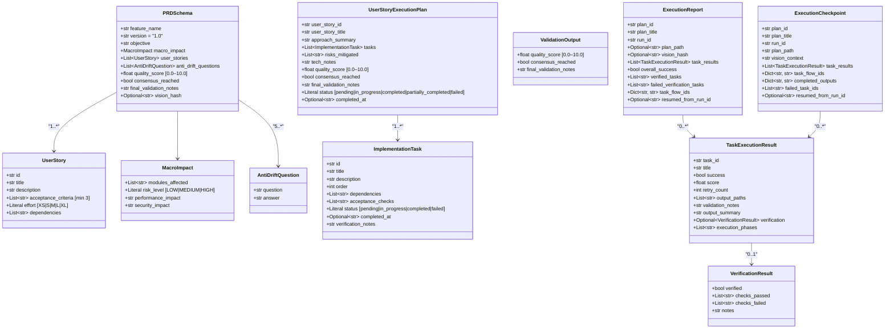
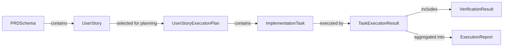
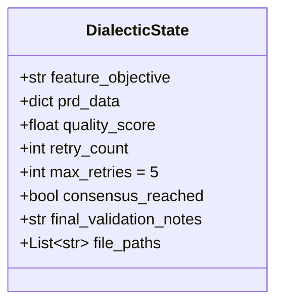
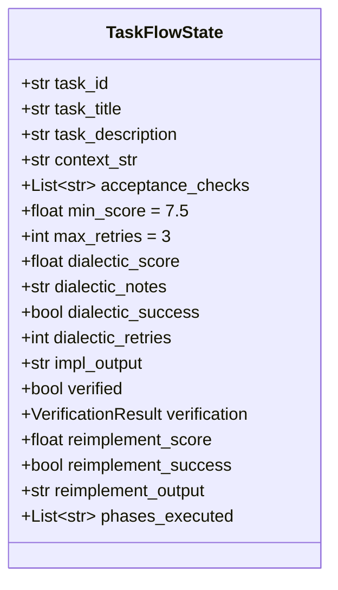

# Data Models

All data models are defined in `src/schemas.py` using [Pydantic v2](https://docs.pydantic.dev/latest/). This file is the **single source of truth** for data structures throughout the system.

---

## Class Diagram

Resume metadata now appears in three places:

- `ExecutionReport.task_flow_ids` maps task IDs to persisted CrewAI flow IDs.
- `ExecutionReport.resumed_from_run_id` records whether a final report continued a prior execution run.
- `ExecutionCheckpoint` stores in-progress execution state under `exec_output/<run_id>/checkpoint.json`.
- `ExecutionCheckpoint.resumed_from_run_id` records the originating execution run when a checkpoint continuation occurs.
- `SelfImprovementRecord` preserves cycle snapshots, selected opportunities, baseline metrics, and resume handles in `.dialectic/self_improve/<cycle-id>.json`.

### `SelfImprovementRecord`

Cycle-level lineage and resume snapshot for `self-improve`.

| Field | Type | Description |
|---|---|---|
| `cycle_id` | `str` | Stable identifier for the self-improve cycle |
| `timestamp` | `str` | Cycle creation timestamp |
| `baseline_metrics` | `dict` | Metrics baseline reused during resume validation |
| `selected_opportunities` | `List[ImprovementOpportunity]` | Prioritized opportunities locked in for this cycle |
| `prd_generated` | `bool` | Whether the PRD stage already completed |
| `plan_generated` | `bool` | Whether the planning stage already completed |
| `execution_attempted` | `bool` | Whether execution has already started for this cycle |
| `prd_flow_id` | `str` | Persisted CrewAI PRD flow ID |
| `prd_path_json` / `prd_path_md` | `str` | Exported PRD artifact paths |
| `plan_path_json` / `plan_path_md` | `str` | Exported planning artifact paths |
| `execution_run_id` | `str` | Execution coordinator run ID used for checkpoint resume |
| `execution_task_flow_ids` | `Dict[str, str]` | Persisted task flow IDs created during execution |
| `execution_output_path` | `str` | Output directory for execution artifacts |
| `execution_report_path` | `str` | Final execution report path |
| `failure_reason` | `str` | Last known failure reason before resume or final abort |

`SelfImprovementRecord` is the durable snapshot used by `dialectic-crew self-improve --resume <cycle-id>`.

---

## Model Details

### PRD Models

#### `PRDSchema`

The complete Product Requirement Document. Generated by the `DialecticFlow` PRD generation pipeline.

| Field | Type | Constraints | Description |
|-------|------|-------------|-------------|
| `feature_name` | `str` | required | Name of the feature |
| `version` | `str` | default `"1.0"` | PRD version |
| `objective` | `str` | required | Clear statement of the feature's purpose |
| `macro_impact` | `MacroImpact` | required | Impact assessment |
| `user_stories` | `List[UserStory]` | min 1 | User stories for the feature |
| `anti_drift_questions` | `List[AntiDriftQuestion]` | min 5 | Vision alignment Q&A |
| `quality_score` | `float` | 0.0–10.0 | Quality score from the Validator |
| `consensus_reached` | `bool` | default `False` | Whether dialectic consensus was reached |
| `final_validation_notes` | `str` | required | Validator's detailed notes |

#### `UserStory`

Individual user story within a PRD.

| Field | Type | Constraints | Description |
|-------|------|-------------|-------------|
| `id` | `str` | required | e.g., `US-001` |
| `title` | `str` | required | Short title |
| `description` | `str` | required | Full description |
| `acceptance_criteria` | `List[str]` | min 3 | Testable criteria |
| `effort` | `Literal` | `XS\|S\|M\|L\|XL` | Estimated effort |
| `dependencies` | `List[str]` | default `[]` | Dependencies on other user stories |

#### `MacroImpact`

Impact assessment for the system.

| Field | Type | Constraints | Description |
|-------|------|-------------|-------------|
| `modules_affected` | `List[str]` | required | System modules impacted |
| `risk_level` | `Literal` | `LOW\|MEDIUM\|HIGH` | Overall risk assessment |
| `performance_impact` | `str` | required | Performance considerations |
| `security_impact` | `str` | required | Security considerations |

#### `AntiDriftQuestion`

Question-answer pair ensuring alignment with `VISION.md`.

| Field | Type | Description |
|-------|------|-------------|
| `question` | `str` | A probing question about vision alignment |
| `answer` | `str` | The agent's answer demonstrating alignment |

---

### Planning Models

#### `UserStoryExecutionPlan`

Approved implementation plan for a single user story. Produced by the planning dialectic.

| Field | Type | Constraints | Description |
|-------|------|-------------|-------------|
| `user_story_id` | `str` | required | Reference to the user story |
| `user_story_title` | `str` | required | User story title |
| `approach_summary` | `str` | required | Technical approach summary |
| `tasks` | `List[ImplementationTask]` | min 1 | Ordered implementation tasks |
| `risks_mitigated` | `List[str]` | default `[]` | Risks that were identified and mitigated |
| `tech_notes` | `str` | default `""` | Technical notes |
| `quality_score` | `float` | 0.0–10.0 | Plan quality score |
| `consensus_reached` | `bool` | default `False` | Whether plan was approved |
| `final_validation_notes` | `str` | default `""` | Validator's notes |
| `status` | `Literal` | `pending\|in_progress\|completed\|partially_completed\|failed` | User story execution status. Updated automatically by the execution flow and post-execution verification |
| `completed_at` | `Optional[str]` | ISO datetime | When the user story was verified as completed |

#### `ImplementationTask`

Single task within an execution plan.

| Field | Type | Constraints | Description |
|-------|------|-------------|-------------|
| `id` | `str` | required | e.g., `T-001` |
| `title` | `str` | required | Task title |
| `description` | `str` | required | Detailed description |
| `order` | `int` | default `0` | Execution order |
| `dependencies` | `List[str]` | default `[]` | Task IDs this depends on |
| `acceptance_checks` | `List[str]` | default `[]` | Verifiable criteria (e.g., "file X exists") |
| `status` | `Literal` | `pending\|in_progress\|completed\|failed` | Current status |
| `completed_at` | `Optional[str]` | ISO datetime | When the task was completed |
| `verification_notes` | `str` | default `""` | Notes from verification |

---

### Execution Models

#### `ValidationOutput`

Structured output from the Validator agent. Used with `output_pydantic` on CrewAI Tasks.

| Field | Type | Constraints | Description |
|-------|------|-------------|-------------|
| `quality_score` | `float` | 0.0–10.0 | Score assigned by the Validator |
| `consensus_reached` | `bool` | default `False` | Approval decision |
| `final_validation_notes` | `str` | default `""` | Explanation |

#### `VerificationResult`

Result of post-execution verification (Phase A in the task execution flow).

| Field | Type | Description |
|-------|------|-------------|
| `verified` | `bool` | Whether all essential artifacts exist |
| `checks_passed` | `List[str]` | Checks that passed |
| `checks_failed` | `List[str]` | Checks that failed |
| `notes` | `str` | Verification explanation |

#### `TaskExecutionResult`

Per-task execution result, including all phases.

| Field | Type | Description |
|-------|------|-------------|
| `task_id` | `str` | Task identifier |
| `title` | `str` | Task title |
| `success` | `bool` | Whether the task ultimately succeeded |
| `score` | `float` | Best score achieved across all phases |
| `retry_count` | `int` | Number of dialectic retries |
| `output_paths` | `List[str]` | Files created/modified |
| `validation_notes` | `str` | Combined notes from all phases |
| `output_summary` | `str` | Summary of implementation output |
| `verification` | `Optional[VerificationResult]` | Verification details (if Phase A ran) |
| `execution_phases` | `List[str]` | Phases executed: `dialectic`, `verify`, `reimplement` |

#### `ExecutionReport`

Full report for a plan execution run.

| Field | Type | Description |
|-------|------|-------------|
| `plan_id` | `str` | User story ID |
| `plan_title` | `str` | User story title |
| `run_id` | `str` | Timestamp-based run identifier |
| `task_results` | `List[TaskExecutionResult]` | Per-task results |
| `overall_success` | `bool` | `True` only if all tasks passed post-execution verification |
| `verified_tasks` | `List[str]` | Task IDs that passed post-execution PRD verification |
| `failed_verification_tasks` | `List[str]` | Task IDs that failed execution or post-execution verification |

---

## Data Flow Between Models

---

## State Models

These models are used as CrewAI Flow state (not in `schemas.py`):

### `DialecticState` (`src/dialectic/state.py`)

State for the PRD generation flow.

| Field | Type | Description |
|-------|------|-------------|
| `feature_objective` | `str` | The feature request from the user |
| `prd_data` | `dict` | Serialized PRD data |
| `quality_score` | `float` | Current quality score (0-10) |
| `retry_count` | `int` | Number of retries so far |
| `max_retries` | `int` | Maximum retries allowed (default: 5) |
| `consensus_reached` | `bool` | Whether consensus was reached |
| `final_validation_notes` | `str` | Validator's notes |
| `file_paths` | `list[str]` | Paths to attached reference files (optional, via `--files` CLI flag) |

### `TaskFlowState` (`src/execution/task_flow.py`)

State for the per-task execution flow.

